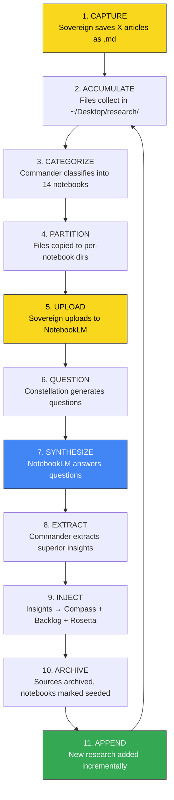

# Research Intake-to-NotebookLM Pipeline: Automation Specification

**Version**: 1.0.0
**Date**: 2026-02-16
**Author**: Commander (COO), Lane 4
**Authority**: Sovereign directive — pipeline elucidation and automation candidate identification
**Depends On**:
- `RESEARCH-CORPUS-CHUNKING-TAXONOMY.md` (14-notebook taxonomy, 267 files)
- `RESEARCH-CORPUS-SOVEREIGN-CURATION-PATTERN.md` (save algorithm, author trust tiers)
- `RESEARCH-CORPUS-REPO-EXTRACTION.md` (42 repos, 14 npm packages extracted)

---

## I. Pipeline Flowchart

```
                    RESEARCH INTAKE-TO-NOTEBOOKLM PIPELINE
                    ======================================

    SOVEREIGN                         CONSTELLATION                    NOTEBOOKLM
    --------                         -------------                    ----------

    [1. CAPTURE]
    X/Twitter article ──save──> ~/Desktop/research/*.md
         |
         v
    [2. ACCUMULATE]
    Files accumulate (1-32/day) until session threshold
         |
         v
                              [3. CATEGORIZE]
                              Commander classifies each .md
                              into 1 of 14 notebook categories
                              using filename + content signals
         |
         v
                              [4. PARTITION]
                              Files copied to per-notebook
                              staging directories:
                              ~/Desktop/research/partitions/
                                  NB01-openclaw-setup/
                                  NB02-agent-security/
                                  ... (14 directories)
         |
         v
    [5. UPLOAD]
    Sovereign opens NotebookLM ─────────────────────> [Create notebook]
    Drags .md files per partition ──────────────────> [Add sources]
         |
         v
                              [6. QUESTION]
                              Constellation generates
                              thoughtful questions per notebook
                              (syncrescendent, prescient, wise)
         |
         v
    [7. SYNTHESIZE]
    Sovereign pastes questions ─────────────────────> [Query notebook]
    NotebookLM generates insights <─────────────────  [AI response]
         |
         v
                              [8. EXTRACT]
                              Commander identifies
                              "unequivocally superior insights"
                              from NotebookLM responses
         |
         v
                              [9. INJECT]
                              Insights integrated into:
                              - ARCH-INTENTION_COMPASS.md
                              - IMPLEMENTATION-BACKLOG.md
                              - REF-ROSETTA_STONE.md
                              - 05-SIGMA/ knowledge corpus
         |
         v
                              [10. ARCHIVE]
                              Processed research marked as seeded.
                              Source .md files archived:
                              04-SOURCES/research/batch-YYYY-MM-DD/
         |
         v
    [11. APPEND]
    New articles saved ──> classified ──> uploaded to existing
    notebooks as incremental sources ──────────────> [Add sources]
```

### Mermaid Flowchart



**Legend**: Yellow = Sovereign-required. Blue = NotebookLM. Green = feedback loop.

---

## II. Step-by-Step Process Documentation

### Step 1: CAPTURE

**Actor**: Sovereign (human)
**Location**: X/Twitter via Safari or dedicated reading app
**Action**: When an article matches the Sovereign Curation Profile (documented in `RESEARCH-CORPUS-SOVEREIGN-CURATION-PATTERN.md`), the Sovereign saves it as a markdown file.

**Naming convention** (observed from corpus):
```
YYYYMMDD-x_article-TITLE_SLUG-@AUTHOR.md
YYYYMMDD-x_thread-TITLE_SLUG-@AUTHOR.md
YYYYMMDD-website-TITLE_SLUG--SOURCE.md
```

**Save destination**: `/Users/system/Desktop/research/`

**Triggering conditions** (deduced from curation pattern):
- At least 2 of 8 primary/secondary triggers fire (see curation pattern doc)
- Article passes the "Maximal Consensus Test" -- is this the definitive articulation of an emerging consensus position?
- Author is pre-trusted (15 authors in Tier 1) OR meets new-author quality threshold

**Current throughput**: 7.2 files/day average, peak 32 files/day (2026-02-05)

### Step 2: ACCUMULATE

**Actor**: Filesystem (passive)
**Action**: Files accumulate until the Sovereign initiates a processing session.
**Session threshold**: Not formally defined. The observed pattern suggests processing is triggered by:
- A wave completing (e.g., the ClawdBot wave Jan 24-28, the Opus 4.6 wave Feb 2-8)
- The Sovereign entering "synthesis deceleration" mode (saves drop to <10/day)
- An ad hoc decision that enough signal has been collected

**Current state**: 267 files accumulated over 37 days before first processing session (2026-02-16).

### Step 3: CATEGORIZE

**Actor**: Commander (COO) or designated Constellation agent
**Action**: Each .md file is assigned to exactly one of 14 notebook categories based on:
1. **Filename signals**: Date, source type (article/thread/website), title keywords, author handle
2. **Content signals**: First ~500 words read for thematic classification
3. **Author clustering**: Known authors map to known domains (e.g., @arscontexta -> Notebook 4: Agentic Note-Taking)
4. **Cross-domain resolution**: Files touching multiple themes are assigned to their PRIMARY cluster; cross-references noted

**Taxonomy** (14 notebooks, documented in `RESEARCH-CORPUS-CHUNKING-TAXONOMY.md`):
1. OpenClaw: Architecture & Setup (32 files)
2. Agent Security & Hardening (14 files)
3. Agent Memory Systems (16 files)
4. Agentic Note-Taking & Knowledge Vaults (11 files)
5. Claude Code & Cowork: Power Patterns (28 files)
6. Multi-Agent Orchestration & Swarms (18 files)
7. The Economic Reckoning: SaaS, Labor, Society (27 files)
8. Vibe Coding & the Software Abundance Thesis (16 files)
9. Design in the AI Era (9 files)
10. AI Engineering: Roadmaps & Architecture (17 files)
11. OpenClaw Deep Research (Constellation) (10 files)
12. Homelab & Infrastructure (11 files)
13. Prompt Engineering & Skills Craft (12 files)
14. Philosophical Wildcards & Cultural Commentary (14 files)

### Step 4: PARTITION

**Actor**: Commander or automation script
**Action**: Create per-notebook staging directories and copy/symlink classified files into them.

**Proposed directory structure**:
```
~/Desktop/research/
  partitions/
    NB01-openclaw-setup/          # 32 files
    NB02-agent-security/          # 14 files
    NB03-agent-memory/            # 16 files
    NB04-agentic-notetaking/      # 11 files
    NB05-claude-code-cowork/      # 28 files
    NB06-multi-agent-orchestration/ # 18 files
    NB07-economic-reckoning/      # 27 files
    NB08-vibe-coding/             # 16 files
    NB09-design-ai-era/           # 9 files
    NB10-ai-engineering/          # 17 files
    NB11-constellation-research/  # 10 files
    NB12-homelab-infrastructure/  # 11 files
    NB13-prompt-craft/            # 12 files
    NB14-philosophical-wildcards/ # 14 files
  manifest.json                   # Partition manifest with file->notebook mapping
```

### Step 5: UPLOAD

**Actor**: Sovereign (manual) or NotebookLM API (automated)
**Action**: For each partition directory, create a corresponding NotebookLM notebook and upload all .md files as sources.

**NotebookLM source limits** (observed):
- Maximum 50 sources per notebook (consumer)
- Maximum 500,000 words per source
- Supported formats: PDF, TXT, Markdown (.md), DOCX, Google Docs, YouTube URLs, web URLs

**Upload order** (recommended, highest-value-first):
1. Notebook 4 (Agentic Note-Taking) -- highest density of novel thinking
2. Notebook 3 (Agent Memory) -- engineering complement to #4
3. Notebook 7 (Economic Reckoning) -- strategic macro context
4. Notebook 11 (Deep Research) -- constellation intelligence
5-14. Remaining notebooks in priority order from taxonomy doc

### Step 6: QUESTION

**Actor**: Constellation agents (Commander, Cartographer, Ajna, Psyche)
**Action**: Generate a set of 5-15 questions per notebook designed to extract maximum insight from the corpus of sources within that notebook.

**Question formulation guidance** (see Section VI for full protocol):
- Questions should be syncrescendent, prescient, wise, illuminating, and sapient
- Questions should target cross-source synthesis, not single-source retrieval
- Questions should probe for named phenomena, structural theses, and contrarian signals
- Each question should have a strategic purpose linked to a Syncrescendence objective

### Step 7: SYNTHESIZE

**Actor**: Sovereign (inputs questions) + NotebookLM (generates answers)
**Action**: For each notebook, paste the generated questions into the NotebookLM chat. Capture NotebookLM's synthesized responses.

**NotebookLM behavior notes**:
- NotebookLM answers are grounded in the uploaded sources (cites specific sources)
- Best results come from questions that require cross-referencing multiple sources
- Follow-up questions within the same chat session build on previous context
- Audio Overview feature can generate podcast-style synthesis of the entire notebook

### Step 8: EXTRACT

**Actor**: Commander (COO)
**Action**: Review all NotebookLM responses across all 14 notebooks. Identify insights that are "unequivocally superior" -- meaning they:
1. Reveal a pattern invisible from any single source
2. Name a phenomenon or dynamic not previously captured in the Syncrescendence scaffold
3. Directly advance a stated intention in the Intention Compass
4. Challenge or strengthen an existing strategic thesis
5. Identify a capability gap or opportunity not previously recognized

**Output**: A structured insights document with each insight tagged by:
- Source notebook(s)
- Injection target (Compass / Backlog / Rosetta / Sigma)
- Confidence level (HIGH / MEDIUM / SPECULATIVE)
- Strategic relevance (which IIC stream it maps to)

### Step 9: INJECT

**Actor**: Commander + relevant Constellation agents
**Action**: Route each extracted insight to its target artifact:

| Target | Artifact | Injection Method |
|--------|----------|-----------------|
| Intent Compass | `ARCH-INTENTION_COMPASS.md` | New intention or update existing |
| Implementation Backlog | `IMPLEMENTATION-BACKLOG.md` | New IMPL-* entries (Tranche P) |
| Rosetta Stone | `REF-ROSETTA_STONE.md` | New terms in categories 18-24 |
| Sigma Knowledge | `05-SIGMA/` | New mechanics/ or practice/ docs |
| Canon | `01-CANON/` | If insight reaches canonical certainty |

### Step 10: ARCHIVE

**Actor**: Commander or automation script
**Action**:
1. Move processed .md files from `~/Desktop/research/` to `04-SOURCES/research/batch-YYYY-MM-DD/`
2. Update partition manifest with processing status
3. Mark corresponding NotebookLM notebooks as "seeded" in tracking ledger
4. Commit archive operation to repository

### Step 11: APPEND

**Actor**: Sovereign (capture) + Commander (categorize) + Sovereign or API (upload)
**Action**: As new articles are saved, they are classified against the existing 14-notebook taxonomy and uploaded as new sources to the appropriate existing NotebookLM notebook. This is an incremental operation -- the notebook already has context from its initial seeding.

**Append triggers**:
- A new article by a Tier 1 author in a known domain
- A significant event (new model launch, market crash, security incident)
- A series installment (e.g., @molt_cornelius Part 7)
- Accumulation of 5+ new files in a single category

---

## III. Automation Candidate Matrix

| # | Step | Current State | Automation Candidate | Tool/Approach | Priority | Blockers |
|---|------|--------------|---------------------|---------------|----------|----------|
| 1 | **CAPTURE** | Fully manual | Browser extension or X bookmark-to-markdown pipeline | Reader/Omnivore/Jina Reader + Hazel trigger | P2 | Sovereign's curation is irreplaceable judgment; automation here is about format conversion, not selection |
| 2 | **ACCUMULATE** | Fully manual (passive) | Threshold-based session trigger when file count or time since last processing exceeds limit | `launchd` watcher + count-based alert to Sovereign | P1 | Defining optimal threshold (count vs. time vs. wave-completion) |
| 3 | **CATEGORIZE** | Manual (Commander) | LLM-based auto-classification using filename + first 500 words + author handle against taxonomy | Python script with Opus/Haiku classifier + Hazel trigger on new .md files | **P0** | Need stable taxonomy; current 14-notebook schema is stable |
| 4 | **PARTITION** | Manual | Script that reads classification output and copies files to partition directories | `partition_research.sh` (bash) or `partition_research.py` (Python) | **P0** | Depends on Step 3 classification output format |
| 5 | **UPLOAD** | Fully manual (browser drag-and-drop) | NotebookLM Enterprise API or `notebooklm-py` CLI | NotebookLM Enterprise API (`notebooks.create` + `sources.batchCreate` + `sources.uploadFile`) | **P0** | Enterprise API is Pre-GA; consumer NotebookLM has no official API; `notebooklm-py` uses undocumented APIs |
| 6 | **QUESTION** | Manual (Sovereign + Constellation) | Constellation auto-generates questions per notebook using taxonomy metadata + Rosetta terms | Commander/Cartographer skill: `/generate_notebook_questions` | P1 | Question quality requires strategic context loading |
| 7 | **SYNTHESIZE** | Manual (Sovereign pastes into NotebookLM) | NotebookLM API chat endpoint (if available) or `notebooklm-py` chat feature | NotebookLM Enterprise API (no chat endpoint documented yet) or `notebooklm-py` ask feature | P1 | No official chat/query API in Enterprise offering; `notebooklm-py` has `ask` feature via undocumented API |
| 8 | **EXTRACT** | Manual (Commander) | Semi-automated: LLM reads all synthesis outputs, flags insights meeting extraction criteria | Commander skill: `/extract_insights` with criteria checklist | P1 | Judgment-heavy; needs human validation of "unequivocally superior" threshold |
| 9 | **INJECT** | Manual (Commander) | Semi-automated: script routes tagged insights to target artifacts with templated entries | `inject_insight.py` with target routing + template generation | P2 | Cross-artifact injection requires understanding current state of each target |
| 10 | **ARCHIVE** | Manual | Fully automatable: move files, update manifest, commit | `archive_research.sh` | P1 | Simple scripting; depends on Steps 1-9 completing successfully |
| 11 | **APPEND** | Manual | Combination of Steps 3-5 for incremental additions to existing notebooks | Same as Steps 3-5 pipeline, triggered by Hazel or `launchd` watcher | P1 | Requires notebook ID tracking (which NotebookLM notebook corresponds to which partition) |

---

## IV. Detailed Automation Designs

### A. Auto-Categorization (Step 3) -- P0

**Design**: A Python script that classifies new .md files against the 14-notebook taxonomy.

**Inputs**:
- File path of new .md file
- Taxonomy definition (JSON: notebook ID, name, keywords, trusted authors, signal patterns)
- Optional: file content (first 500 words for content-based classification)

**Classification algorithm** (three-tier):
1. **Author match** (fastest): If `@author` handle maps to a known notebook via trusted-author registry, classify immediately. (e.g., `@arscontexta` -> NB04, `@danielmiessler` -> NB02 or NB07)
2. **Keyword match** (fast): Title slug matched against notebook keyword dictionaries. Weighted scoring: exact match = 3 points, partial match = 1 point. Highest-scoring notebook wins.
3. **LLM classification** (slow, accurate): For ambiguous cases, send filename + first 500 words to Claude Haiku with a classification prompt. Cost: ~$0.001/file at Haiku rates.

**Output**: JSON manifest mapping each file to a notebook ID:
```json
{
  "files": [
    {
      "path": "20260205-x_article-software_abundance-@saranormous.md",
      "notebook": "NB07",
      "confidence": 0.95,
      "method": "keyword_match",
      "cross_refs": ["NB08"]
    }
  ]
}
```

**Trigger options**:
- **Hazel** (macOS): Watch `~/Desktop/research/` for new `.md` files, run classification script on each new file
- **launchd** (macOS): Periodic scan (every 15 minutes) of `~/Desktop/research/` for unclassified files
- **fswatch** (CLI): Real-time filesystem event watcher, lightweight alternative to Hazel

**Recommended**: Hazel for the MacBook Air (Ajna's home, where Sovereign saves files). Hazel is already a known macOS automation tool in the Sovereign's ecosystem and provides immediate visual feedback via Growl/Notification Center.

### B. Auto-Partitioning (Step 4) -- P0

**Design**: Script that reads the classification manifest and creates/populates partition directories.

```bash
#!/bin/bash
# partition_research.sh
# Reads manifest.json, creates partition dirs, copies/symlinks files

RESEARCH_DIR="$HOME/Desktop/research"
PARTITIONS_DIR="$RESEARCH_DIR/partitions"
MANIFEST="$RESEARCH_DIR/manifest.json"

# Create partition directories if they don't exist
for i in $(seq -w 1 14); do
    nb_name=$(jq -r ".notebooks[\"NB${i}\"].slug" "$MANIFEST")
    mkdir -p "$PARTITIONS_DIR/NB${i}-${nb_name}"
done

# Copy files to their assigned partitions
jq -r '.files[] | "\(.notebook) \(.path)"' "$MANIFEST" | while read nb path; do
    cp "$RESEARCH_DIR/$path" "$PARTITIONS_DIR/$nb-*/"
done
```

### C. NotebookLM Upload Automation (Step 5) -- P0

**Three paths**, in order of preference:

#### Path 1: NotebookLM Enterprise API (Official, Pre-GA)

**Status**: Pre-GA (Preview). Available to Google Cloud customers with "Cloud NotebookLM User" IAM role.

**Supported operations**:
- `notebooks.create` -- Create a new notebook with title
- `notebooks.sources.batchCreate` -- Add multiple sources in one call
- `notebooks.sources.uploadFile` -- Upload individual files (supports `.md` with `text/markdown` MIME type)
- `notebooks.sources.get` -- Retrieve source metadata (word count, token count)
- `notebooks.sources.batchDelete` -- Remove sources
- `notebooks.share` -- Share notebooks with role-based access

**Authentication**: Google Cloud credentials via `gcloud` CLI. Bearer token auth.

**Regional endpoints**: US, EU, Global.

**Critical limitation**: No documented chat/query API endpoint. You can create notebooks and add sources programmatically, but querying the notebook (Step 7) still requires manual interaction or the unofficial tool.

**Implementation**:
```python
# Pseudocode for NotebookLM Enterprise API upload
from google.cloud import notebooklm_enterprise

client = notebooklm_enterprise.NotebookServiceClient()

# Create notebook
notebook = client.create_notebook(title="NB04: Agentic Note-Taking & Knowledge Vaults")

# Upload markdown sources
for md_file in partition_files("NB04"):
    client.upload_file(
        notebook=notebook.name,
        file_path=md_file,
        content_type="text/markdown",
        display_name=md_file.stem
    )
```

**Prerequisite**: Google Cloud project with NotebookLM Enterprise enabled. Requires Google Workspace Enterprise or AI Premium plan.

#### Path 2: notebooklm-py (Unofficial, Active)

**Status**: v0.3.2 (2026-01-26). 460 commits. Active maintenance. Uses undocumented Google APIs.

**Supported operations** (exceeds official API):
- Create, list, rename, delete notebooks
- Add URLs, YouTube, PDFs, Google Drive files, markdown
- **Ask questions** (chat with notebook sources -- this is the critical differentiator)
- Generate audio overviews, podcasts, quizzes, flashcards, study guides
- Download artifacts as MP3, MP4, PDF, PNG, CSV, JSON, Markdown
- Web research with auto-source importing

**Authentication**: Browser-based (opens browser for Google login, stores credentials locally).

**Critical advantage**: This tool supports the chat/query function (Step 7) that the official Enterprise API does not document.

**Critical risk**: Uses undocumented APIs that can break without notice. Not suitable for production, but excellent for prototyping the pipeline.

**Implementation**:
```bash
# Install
pip install notebooklm-py

# Create notebook and add sources
notebooklm create "NB04: Agentic Note-Taking"
notebooklm add-source --notebook "NB04" --file ./partitions/NB04-agentic-notetaking/*.md

# Query the notebook (this is the killer feature)
notebooklm ask --notebook "NB04" "What is the emerging consensus on wikilinks as cognitive architecture vs. traditional hierarchical note structures?"
```

#### Path 3: Hybrid (Recommended)

Use **NotebookLM Enterprise API** for notebook creation and source management (stable, official), and **notebooklm-py** for querying/chat (unofficial but uniquely capable). Fall back to manual browser interaction for querying if notebooklm-py breaks.

### D. Question Generation (Step 6) -- P1

**Design**: A Commander skill (`/generate_notebook_questions`) that produces 5-15 questions per notebook.

**Input context loaded per notebook**:
1. Notebook taxonomy entry (theme, key insights, signal strength, notable authors)
2. Relevant Rosetta Stone terms (categories 18-24 for convergence vision)
3. Current Intention Compass priorities
4. Cross-notebook resonance notes from taxonomy doc

**Question generation prompt template**:
```
You are generating questions for a NotebookLM notebook containing {file_count}
research articles on the theme: "{notebook_theme}".

The notebook contains articles from these key authors: {notable_authors}
The key insights expected in this corpus are: {key_insights}

Generate {n} questions that are:
- SYNCRESCENDENT: They connect the corpus to the larger civilizational transition
- PRESCIENT: They anticipate where the consensus is heading, not where it is
- WISE: They prioritize durable structural insight over trendy observations
- ILLUMINATING: They reveal cross-source patterns invisible to single-article reads
- SAPIENT: They embody judgment about what matters, not just what's interesting

Question types to include:
1. SYNTHESIS: "What is the emerging consensus across these {file_count} sources on [X]?"
2. TENSION: "Where do the sources disagree, and what does the disagreement reveal?"
3. NAMED PHENOMENA: "What new concepts or frameworks are being proposed, and which will endure?"
4. TRAJECTORY: "Based on these sources, what happens next in [domain]?"
5. CONTRARIAN: "What is the strongest argument AGAINST the consensus position in these sources?"
6. STRUCTURAL: "What durable architectural primitive or pattern emerges from this corpus?"
7. CONVERGENCE: "How does this corpus connect to [Syncrescendence objective]?"

Current Syncrescendence priorities:
{intention_compass_summary}

Relevant Rosetta Stone terms:
{rosetta_terms}
```

### E. Hazel Integration Design -- P0/P1

**Hazel rule for ~/Desktop/research/**:

```
Rule Name: "Research Article Auto-Classify"
Conditions:
  - Extension IS "md"
  - Date Added IS IN THE LAST 1 hour
  - Name DOES NOT contain "manifest"
  - Name DOES NOT contain "README"
Actions:
  1. Run shell script: /Users/system/Desktop/syncrescendence/00-ORCHESTRATION/scripts/classify_research.sh "$1"
  2. Display notification: "Research classified: [filename]"
```

**classify_research.sh** would:
1. Run the classification algorithm (author match -> keyword match -> LLM fallback)
2. Append result to `manifest.json`
3. Copy file to appropriate partition directory
4. If partition reaches append threshold (5+ new files), notify Sovereign

### F. Accumulation Threshold Alert (Step 2) -- P1

**Design**: launchd agent that checks research directory state daily.

```xml
<!-- com.syncrescendence.research-threshold.plist -->
<plist version="1.0">
<dict>
    <key>Label</key>
    <string>com.syncrescendence.research-threshold</string>
    <key>ProgramArguments</key>
    <array>
        <string>/Users/system/Desktop/syncrescendence/00-ORCHESTRATION/scripts/research_threshold.sh</string>
    </array>
    <key>StartCalendarInterval</key>
    <dict>
        <key>Hour</key><integer>9</integer>
        <key>Minute</key><integer>0</integer>
    </dict>
</dict>
</plist>
```

**research_threshold.sh** logic:
- Count unprocessed files in `~/Desktop/research/` (not in partitions/)
- If count > 20 OR days since last processing > 7: alert Sovereign
- Alert via terminal-notifier or osascript notification

---

## V. NotebookLM-Specific Notes and Limitations

### What NotebookLM Does Well
1. **Cross-source synthesis**: Given 10-30 markdown sources in a notebook, NotebookLM excels at finding patterns across them that no single read would reveal.
2. **Citation grounding**: Every claim references specific sources by name, enabling verification.
3. **Audio Overview**: Generates a podcast-style conversation about the notebook contents -- useful for passive absorption during commutes or walks.
4. **Incremental source addition**: New sources can be added to existing notebooks; the AI updates its understanding.

### What NotebookLM Does Poorly
1. **No chat/query API** (official): The Enterprise API supports creating notebooks and managing sources, but does NOT document a programmatic query/chat endpoint.
2. **Source limits**: 50 sources max per notebook (consumer). Some notebooks (NB01: 32 files, NB05: 28 files, NB07: 27 files) are close to or within limits; future growth may require splitting.
3. **No bulk export**: Insights generated within NotebookLM cannot be bulk-exported programmatically via the official API.
4. **No inter-notebook queries**: Each notebook is isolated. You cannot query across multiple notebooks simultaneously (a significant limitation for cross-notebook resonance analysis).
5. **Session context**: Chat history within a notebook builds context, but there's no way to "save" a synthesis session as a structured artifact (you must copy-paste).

### Enterprise API Status (as of 2026-02-16)

| Feature | Status | API Method |
|---------|--------|-----------|
| Create notebooks | Pre-GA | `notebooks.create` |
| List notebooks | Pre-GA | `notebooks.listRecentlyViewed` |
| Delete notebooks | Pre-GA | `notebooks.batchDelete` |
| Share notebooks | Pre-GA | `notebooks.share` |
| Upload .md sources | Pre-GA | `notebooks.sources.uploadFile` |
| Batch add sources | Pre-GA | `notebooks.sources.batchCreate` |
| Delete sources | Pre-GA | `notebooks.sources.batchDelete` |
| Get source metadata | Pre-GA | `notebooks.sources.get` |
| Audio overview gen | Pre-GA (allowlist) | Podcast API |
| Chat/query | **NOT AVAILABLE** | -- |
| Bulk export insights | **NOT AVAILABLE** | -- |

### Unofficial Tool: notebooklm-py

| Feature | Status | Command |
|---------|--------|---------|
| Create notebooks | Working (v0.3.2) | `notebooklm create` |
| Add sources | Working | `notebooklm add-source` |
| Chat/query | **Working** | `notebooklm ask` |
| Audio overview | Working | `notebooklm generate-audio` |
| Generate podcasts | Working | `notebooklm generate-podcast` |
| Quizzes/flashcards | Working | `notebooklm generate-quiz` |
| Study guides | Working | `notebooklm generate-study-guide` |
| Download artifacts | Working | `notebooklm download` |
| Web research | Working | `notebooklm research` |

**Risk assessment**: Uses undocumented Google APIs. May break without notice. Suitable for prototyping but not production-critical paths. Browser auth required (no headless service account).

### Alternatives to NotebookLM for AI-Assisted Corpus Analysis

If NotebookLM's limitations prove blocking:

| Alternative | Strengths | Weaknesses |
|------------|-----------|------------|
| **Claude with 200K context** | Full API access, programmable, same model family as Commander | No persistent notebook state; must re-upload sources each session |
| **Gemini 2.5 Pro with 1M context** | Enormous context window; can ingest entire corpus at once | No persistent notebook; token cost per query |
| **Obsidian + Claude Code** | Local, sovereign-controlled, integrates with existing vault patterns | Requires building the RAG/synthesis layer manually |
| **QMD** (already in constellation stack) | BM25 + vector search over local markdown; SQLite-based | Search, not synthesis -- lacks the cross-source reasoning |
| **Custom RAG pipeline** | Full control, API-driven, integrates with existing infra | Significant engineering investment; overkill for 267 files |

**Recommendation**: NotebookLM for its unique cross-source synthesis capability (no other tool does this as well for the Sovereign's use case). Supplement with Claude 200K context for programmatic queries when NotebookLM's lack of chat API is blocking.

---

## VI. Question Formulation Guidance

### The Syncrescendence Question Protocol

Questions posed to NotebookLM notebooks should embody six qualities:

#### 1. SYNCRESCENDENT
Connect the corpus to the larger civilizational transition being navigated.
- BAD: "What does @arscontexta say about Obsidian?"
- GOOD: "What architectural pattern for human-AI knowledge co-construction emerges from these sources, and how does it challenge the assumption that knowledge management is a solo human activity?"

#### 2. PRESCIENT
Anticipate where the discourse is heading, not where it currently is.
- BAD: "What are the current best practices for agent memory?"
- GOOD: "Given the tension between graph-based and text-based memory approaches in these sources, what hybrid architecture is likely to emerge as the consensus within 6 months?"

#### 3. WISE
Prioritize durable structural insight over trendy observations.
- BAD: "Which tool is the most popular for agent orchestration?"
- GOOD: "What fundamental constraint on multi-agent coordination do these sources collectively reveal, regardless of which orchestration framework is used?"

#### 4. ILLUMINATING
Reveal cross-source patterns invisible to single-article reads.
- BAD: "Summarize the security articles."
- GOOD: "Across these 14 security-focused sources, what is the most dangerous assumption that even the security-conscious authors share?"

#### 5. SAPIENT
Embody judgment about what matters, not just what's interesting.
- BAD: "What are all the frameworks mentioned in these sources?"
- GOOD: "Of the architectural patterns described in these sources, which three would still be relevant if the underlying LLM technology doubled in capability next month?"

#### 6. CONVERGENT
Link findings to specific Syncrescendence objectives and artifacts.
- BAD: "What economic impacts are discussed?"
- GOOD: "Which economic thesis from these sources most directly challenges or validates the 'Risk Removed / Time Returned' value proposition in our convergence economics framework (Rosetta Stone Cat. 23)?"

### Question Templates by Notebook Type

#### For Technical Notebooks (NB01-06, NB10, NB12-13):
```
1. "What is the emerging architectural consensus across these {N} sources?"
2. "Where do practitioners disagree with theorists, and what does that reveal?"
3. "What capability gap do these sources collectively expose in current tooling?"
4. "Which pattern described here would compound most over 12 months of use?"
5. "What implicit assumption do ALL these authors share that might be wrong?"
```

#### For Strategic/Economic Notebooks (NB07-08):
```
1. "What structural economic shift do these sources agree is inevitable?"
2. "What is the strongest counter-argument to the dominant thesis in this corpus?"
3. "Which named phenomenon from these sources will still be referenced in 5 years?"
4. "What does this corpus reveal about the TIMING of the transition?"
5. "What actionable position should someone building a sovereignty-first business take?"
```

#### For Philosophical/Cultural Notebooks (NB09, NB14):
```
1. "What is the deepest unresolved tension between human identity and AI capability?"
2. "Which author in this corpus is most likely to be proven right, and why?"
3. "What emotional or psychological pattern appears across these sources that the authors themselves may not recognize?"
4. "What does this corpus suggest about the kind of person who thrives in the transition?"
5. "What is being mourned in these sources, and should it be?"
```

#### For Internal Research (NB11):
```
1. "Where do the five research personas agree, and where do they diverge?"
2. "What strategic blind spot do all five share?"
3. "Which recommendation from these research outputs has the highest expected value?"
4. "What competitive threat is most underestimated across the research outputs?"
5. "What would change in our strategy if the most pessimistic assessment here is correct?"
```

---

## VII. Backlog Items (Tranche P -- Pipeline)

### P0 (Immediate -- Enable the Pipeline)

- **IMPL-P-0001** -- Build `classify_research.py`: 3-tier auto-classification script (author match, keyword match, LLM fallback) for research .md files against 14-notebook taxonomy (Priority: P0)
- **IMPL-P-0002** -- Build `partition_research.sh`: Create per-notebook staging directories from classification manifest and copy files to partitions (Priority: P0)
- **IMPL-P-0003** -- Create `taxonomy.json`: Machine-readable notebook taxonomy with notebook IDs, slugs, keywords, trusted authors, signal patterns (Priority: P0)
- **IMPL-P-0004** -- Evaluate NotebookLM Enterprise API access: Determine if Sovereign's Google Workspace account qualifies for Enterprise API Pre-GA; if not, evaluate `notebooklm-py` as bridge (Priority: P0)
- **IMPL-P-0005** -- Build `upload_to_notebooklm.py`: Script to create notebooks and upload partitioned .md sources via API (Enterprise or notebooklm-py fallback) (Priority: P0)

### P1 (Near-term -- Automate the Flow)

- **IMPL-P-0006** -- Configure Hazel rule on MBA: Watch `~/Desktop/research/` for new .md files, trigger `classify_research.py` on each arrival (Priority: P1)
- **IMPL-P-0007** -- Build `/generate_notebook_questions` skill: Commander skill that generates 5-15 questions per notebook using taxonomy metadata + Rosetta terms + Intention Compass (Priority: P1)
- **IMPL-P-0008** -- Build `research_threshold.sh` + launchd plist: Daily check of unprocessed research files, alert Sovereign when count > 20 or days since processing > 7 (Priority: P1)
- **IMPL-P-0009** -- Build `archive_research.sh`: Move processed files to `04-SOURCES/research/batch-YYYY-MM-DD/`, update manifest, commit (Priority: P1)
- **IMPL-P-0010** -- Build NotebookLM tracking ledger: JSON/CSV mapping notebook IDs to NotebookLM notebook names, source counts, last-updated dates, seeding status (Priority: P1)
- **IMPL-P-0011** -- Build `append_to_notebook.py`: Incremental source addition to existing NotebookLM notebooks for new research in classified categories (Priority: P1)
- **IMPL-P-0012** -- Build `/extract_insights` skill: Semi-automated insight extraction from NotebookLM synthesis responses with extraction criteria checklist and target routing (Priority: P1)

### P2 (Future -- Full Automation)

- **IMPL-P-0013** -- Build `inject_insight.py`: Automated routing of tagged insights to target artifacts (Compass, Backlog, Rosetta, Sigma) with templated entries (Priority: P2)
- **IMPL-P-0014** -- Build end-to-end pipeline orchestrator: Single command `make research-pipeline` that runs classify -> partition -> upload -> generate-questions -> synthesize -> extract -> inject -> archive (Priority: P2)
- **IMPL-P-0015** -- Evaluate Claude 200K context as NotebookLM supplement: For notebooks where API query is blocked, use Claude with full corpus loaded as alternative synthesis engine (Priority: P2)
- **IMPL-P-0016** -- Build cross-notebook resonance detector: Script that identifies thematic connections across all 14 notebooks and generates meta-synthesis questions (Priority: P2)
- **IMPL-P-0017** -- Design notebook lifecycle policy: When to split notebooks approaching 50-source limit, when to merge low-activity notebooks, when to archive stale notebooks (Priority: P2)
- **IMPL-P-0018** -- Build research velocity dashboard: Visualization of save rate, classification distribution, notebook saturation, processing lag (Priority: P2)

### P3 (Aspirational -- Full Intelligence Cycle)

- **IMPL-P-0019** -- Autonomous research agent: OpenClaw agent that monitors X for new articles matching Sovereign Curation Profile, auto-saves to research directory (Priority: P3)
- **IMPL-P-0020** -- Continuous notebook refresh: Automated periodic re-querying of notebooks with updated questions as Syncrescendence priorities evolve (Priority: P3)
- **IMPL-P-0021** -- NotebookLM-to-Obsidian bridge: Export NotebookLM synthesis outputs as Obsidian-compatible markdown with wikilinks to source articles (Priority: P3)

---

## VIII. Implementation Sequence

```
Phase 0: Foundation (Week 1)
  IMPL-P-0003 → IMPL-P-0001 → IMPL-P-0002
  (taxonomy.json → classify → partition)

  IMPL-P-0004 → IMPL-P-0005
  (evaluate API access → build upload script)

Phase 1: Automation (Week 2-3)
  IMPL-P-0006 (Hazel rule)
  IMPL-P-0007 (question generation skill)
  IMPL-P-0008 (threshold alerting)
  IMPL-P-0010 (tracking ledger)

Phase 2: Completion (Week 3-4)
  IMPL-P-0009 (archive script)
  IMPL-P-0011 (append to notebooks)
  IMPL-P-0012 (insight extraction skill)

Phase 3: Integration (Month 2)
  IMPL-P-0013 through IMPL-P-0018
  (full automation, cross-notebook analysis, dashboards)
```

---

## IX. Risk Register

| Risk | Impact | Likelihood | Mitigation |
|------|--------|-----------|------------|
| NotebookLM Enterprise API access denied (not on Enterprise plan) | HIGH -- blocks automated upload | MEDIUM | Fall back to `notebooklm-py`; worst case, manual upload remains viable for 14 notebooks |
| `notebooklm-py` breaks due to API changes | MEDIUM -- blocks automated query | HIGH | Maintain manual browser workflow as fallback; monitor tool's GitHub for updates |
| Classification accuracy below 85% | LOW -- some files in wrong notebooks | LOW | Three-tier algorithm with LLM fallback should achieve >90%; misclassification is correctable |
| NotebookLM 50-source limit hit | MEDIUM -- requires notebook splitting | MEDIUM | Only NB01 (32) and NB05 (28) are close; design split protocol in IMPL-P-0017 |
| Sovereign curation pace overwhelms pipeline | LOW -- backlog grows | LOW | Threshold alerting (IMPL-P-0008) ensures timely processing |
| Cross-notebook resonance lost in siloed analysis | HIGH -- misses key insights | MEDIUM | IMPL-P-0016 addresses this; also, question templates include convergence-type questions |

---

## X. References

### Internal Documents
- `/Users/system/Desktop/syncrescendence/00-ORCHESTRATION/state/impl/clarescence/RESEARCH-CORPUS-CHUNKING-TAXONOMY.md`
- `/Users/system/Desktop/syncrescendence/00-ORCHESTRATION/state/impl/clarescence/RESEARCH-CORPUS-SOVEREIGN-CURATION-PATTERN.md`
- `/Users/system/Desktop/syncrescendence/00-ORCHESTRATION/state/impl/clarescence/RESEARCH-CORPUS-REPO-EXTRACTION.md`
- `/Users/system/Desktop/syncrescendence/COCKPIT.md`
- `/Users/system/Desktop/syncrescendence/00-ORCHESTRATION/state/IMPLEMENTATION-BACKLOG.md`

### External References
- [NotebookLM Enterprise API: Notebooks](https://docs.cloud.google.com/gemini/enterprise/notebooklm-enterprise/docs/api-notebooks) -- Official Google Cloud documentation for notebook creation/management
- [NotebookLM Enterprise API: Sources](https://docs.cloud.google.com/gemini/enterprise/notebooklm-enterprise/docs/api-notebooks-sources) -- Official documentation for programmatic source management (supports .md upload)
- [notebooklm-py](https://github.com/teng-lin/notebooklm-py) -- Unofficial Python CLI (v0.3.2, active, 460 commits) with chat/query capability
- [nblm-rs](https://github.com/K-dash/nblm-rs) -- Unofficial Rust-based CLI with Python SDK
- [NotebookLM-py Medium writeup](https://medium.com/@tentenco/notebooklm-py-the-cli-tool-that-unlocks-google-notebooklm-1de7106fd7ca) -- Feature overview and usage guide
- [Hazel for macOS](https://www.noodlesoft.com/) -- Folder-based automation (watch folders, trigger scripts on file events)
- [AutoContent API: Does NotebookLM Have an API?](https://autocontentapi.com/blog/does-notebooklm-have-an-api) -- Status overview of API availability

---

*Generated by Commander (COO), Lane 4, for the Syncrescendence Constellation. This document specifies the complete research intake-to-NotebookLM pipeline with automation candidates, backlog items, and implementation sequence.*
