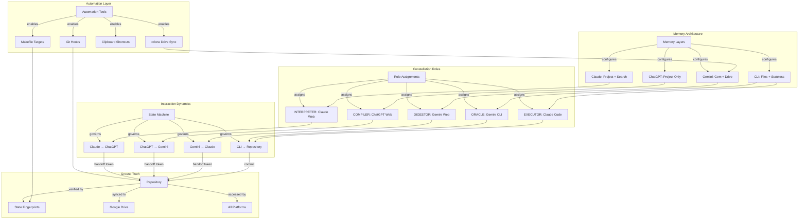

# Interaction Dynamics Specification
## Syncrescendence Constellation: Operational Configuration

**Version**: 1.0  
**Date**: 2026-01-20  
**Status**: COMPREHENSIVE SPECIFICATION  
**Purpose**: Collapse tentative architecture into operational configuration

---

# PART I: THE INTERACTION STATE MACHINE

## 1.1 Fundamental Dynamics

The constellation operates as a **state machine** where each platform transformation moves content through defined states toward repository commitment. The Principal orchestrates transitions; platforms execute transformations; the repository records ground truth.

### State Definitions

| State | Location | Characteristic | Transitions To |
|-------|----------|----------------|----------------|
| `CAPTURED` | Principal's mind / external source | Unstructured, ephemeral | `INTERPRETED` |
| `INTERPRETED` | Claude Web artifact | Structured understanding | `COMPILED`, `DIGESTED`, `SENSED` |
| `COMPILED` | ChatGPT Canvas/artifact | Formatted artifact | `STAGED` |
| `DIGESTED` | Gemini export/Docs | Clarified summary | `INTERPRETED`, `STAGED` |
| `SENSED` | Gemini CLI output | Evidence pack | `INTERPRETED` |
| `VERIFIED` | Perplexity/Grok output | Externally validated | `INTERPRETED` |
| `STAGED` | -OUTGOING/ directory | Ready for commit | `COMMITTED` |
| `COMMITTED` | Repository (git) | Ground truth | Terminal |

### Transition Rules

```
CAPTURED → Claude Web → INTERPRETED
INTERPRETED → ChatGPT Web → COMPILED
INTERPRETED → Gemini Web → DIGESTED  
INTERPRETED → Gemini CLI → SENSED
INTERPRETED → Perplexity → VERIFIED (external facts)
INTERPRETED → Grok → VERIFIED (social context)

COMPILED → Manual download → STAGED
DIGESTED → Google Docs export → STAGED
SENSED → File output → STAGED
VERIFIED → Copy/paste → INTERPRETED (reintegration)

STAGED → Claude Code commit → COMMITTED
```

---

## 1.2 Multi-Round Back-and-Forth Patterns

### Pattern A: Convergent Refinement (Same Platform)

When multiple rounds occur within a single platform:

```
Round 1: Principal → Claude Web → Draft_v1
Round 2: Principal feedback → Claude Web → Draft_v2
Round 3: Principal feedback → Claude Web → Draft_v3 (INTERPRETED)
```

**Mechanism**: Thread continuity. Claude maintains context across turns.
**Limitation**: Thread length. After ~10-15 heavy exchanges, context eviction begins.
**Mitigation**: `/compact` at 70% context. Capture critical outputs to artifacts before compacting.

### Pattern B: Oscillating Refinement (Cross-Platform)

When decisions require bouncing between platforms:

```
Claude Web: Interpret requirements → Draft specification
↓
ChatGPT Web: Compile specification → Formatted document
↓
Principal: Reviews, finds issues
↓
Claude Web: Interpret issues → Revised specification
↓
ChatGPT Web: Recompile → Revised document
```

**Mechanism**: Handoff tokens. Each transition carries state fingerprint + delta brief.
**Limitation**: Manual token transfer (copy/paste).
**Mitigation**: Standardized token format; clipboard automation (see Part IV).

### Pattern C: Triangulated Synthesis (Multi-Platform Parallel)

When decisions need multiple perspectives simultaneously:

```
                    ┌→ Gemini Web (digest) ─────┐
Claude Web (interpret) ─┼→ Perplexity (verify facts) ─┼→ Claude Web (synthesize)
                    └→ Grok (verify social) ────┘
```

**Mechanism**: Claude Web as hub. Interpretation starts and ends in Claude; other platforms contribute specific capabilities.
**Limitation**: Principal must manage parallel queries manually.
**Mitigation**: Use split-screen or multiple monitors. Batch queries to auxiliary platforms.

### Pattern D: Sensing Loop (CLI-Driven)

When decisions require corpus-wide evidence:

```
Gemini CLI: Survey corpus → Evidence pack
↓
Claude Web: Interpret evidence → Strategic implications
↓
Claude Code: Implement changes → Repository update
↓
Gemini CLI: Verify implementation → Updated evidence pack
```

**Mechanism**: File-based handoff. Gemini CLI writes to -OUTGOING/; Claude Code reads and acts.
**Limitation**: CLI is stateless; each invocation is independent.
**Mitigation**: External state management via shell scripts.

---

## 1.3 The Predictability-Accuracy Tradeoff

### Problem Statement

More explicit specifications (predictable) can constrain platform capability (accuracy). Example: Telling ChatGPT exactly what format to produce is predictable but prevents it from recognizing when a different format would be better.

### Resolution: Tiered Specification

| Tier | Specification Level | When to Use | Example |
|------|---------------------|-------------|---------|
| **Strict** | Complete template + constraints | Mechanical transformation | "Format this YAML as markdown table using this exact template" |
| **Guided** | Output structure + quality criteria | Structured creation | "Create a project proposal with these sections: X, Y, Z. Prioritize clarity." |
| **Open** | Goal + constraints only | Creative synthesis | "Explore approaches to this problem. Avoid X, Y." |

### Platform-Tier Mapping

| Platform | Default Tier | Rationale |
|----------|--------------|-----------|
| Claude Web | Open or Guided | Interpretation benefits from latitude |
| ChatGPT Web | Strict | Compilation requires determinism |
| Gemini Web | Guided | Digestion needs structure, not rigidity |
| Gemini CLI | Strict | Sensing must be reproducible |
| Grok | Open | Red-teaming benefits from unpredictability |
| Perplexity | Guided | Verification needs focus, allows exploration |

### Predictability Mechanisms

1. **Templates**: Pre-built structures for common outputs
2. **Checklists**: Required elements for each output type
3. **Verification Hashes**: Fingerprints confirm expected state
4. **Constraint Lists**: Explicit "DO NOT" items catch common failures

---

# PART II: PLATFORM LIMITATION MATRIX

## 2.1 Comprehensive Limitation Analysis

### Claude Web (INTERPRETER)

| Limitation | Impact | Mitigation Strategy |
|------------|--------|---------------------|
| Thread length limits (~45 Pro/5hr) | Extended sessions impossible | Session boundaries at logical breakpoints; `/compact` at 70% |
| Artifacts not searchable cross-thread | Past work invisible | Extract key artifacts to Project Knowledge |
| No Google Drive connector | Can't see synced state | Manual paste of critical state; search past chats |
| Rate limits shared across surfaces | Heavy CLI use depletes web quota | Balance usage across accounts; use Sonnet for high-volume |

**Overcoming Strategy**: Use Claude Web for focused interpretation sessions (1-3 hours). Capture outputs immediately to artifacts or Project Knowledge. Don't rely on returning to old threads—treat each session as potentially final.

### ChatGPT Web (COMPILER)

| Limitation | Impact | Mitigation Strategy |
|------------|--------|---------------------|
| Memory regression in Projects | Global memory overrides project context | Enable Project-Only Memory mode always |
| Weak interpretation of ambiguity | Miscompiles vague specs | Ultra-explicit specifications; never assume interpretation |
| Cannot search past threads | No historical context | Self-contained handoffs; no references to "what we discussed" |
| Canvas not available in all regions/tiers | May need workaround | Use artifact export if Canvas unavailable |

**Overcoming Strategy**: Treat ChatGPT as a stateless function. Every input includes complete context. Never say "as we discussed" or "like before." Templates and explicit constraints prevent interpretation failures.

### Gemini Web (DIGESTOR)

| Limitation | Impact | Mitigation Strategy |
|------------|--------|---------------------|
| No cross-Gem memory | Gem switching loses context | One Gem per session; full context in handoff |
| Context drift on long threads | Model "forgets" early context | Periodic summary anchors; explicit state reminders |
| 10-file Gem limit | Can't include full corpus | Prioritize state files; use Drive links for live docs |
| Export friction (Docs) | Extra step for artifact extraction | Use "Export to Docs" workflow; automate via Drive API eventually |

**Overcoming Strategy**: Leverage infinite thread length for extended synthesis. Use Drive-linked files for auto-updating state. Accept export friction as tradeoff for live-sync capability.

### Gemini CLI (ORACLE)

| Limitation | Impact | Mitigation Strategy |
|------------|--------|---------------------|
| Completely stateless | No memory between invocations | External state via shell scripts; full context every call |
| No conversation continuation | Each call is independent | Batch related queries; include all context in prompt |
| Output goes to stdout | Must capture manually | Redirect to files; pipe to processing scripts |

**Overcoming Strategy**: Embrace statelessness as feature. Each sensing query is independent and reproducible. Write wrapper scripts that provide consistent context framing.

### Grok (RED TEAM)

| Limitation | Impact | Mitigation Strategy |
|------------|--------|---------------------|
| No persistent configuration | Context from zero every time | Brief context preamble; accept fresh perspective |
| X-only data access | Limited to social context | Use for social validation only; don't expect general research |
| No projects or memory | Cannot maintain state | Single-query invocations; capture relevant output immediately |

**Overcoming Strategy**: Use Grok for its unique capability (X Firehose) only. Don't try to make it remember context—its value is the fresh adversarial perspective.

### Perplexity (VERIFIER)

| Limitation | Impact | Mitigation Strategy |
|------------|--------|---------------------|
| No persistent configuration | Context from zero every time | Complete query in single message |
| Citation-optimized, not synthesis | Doesn't create new ideas | Use only for verification, not interpretation |
| Limited API access | Can't automate easily | Manual invocation; copy results to hub platform |

**Overcoming Strategy**: Invoke for discrete verification tasks only. Extract citations and reintegrate into Claude Web for synthesis.

---

## 2.2 Cross-Platform Porting Protocols

### Claude Web → ChatGPT Web (Interpretation → Compilation)

**Payload**:
```yaml
handoff_type: interpret_to_compile
content:
  specification: [Full spec text - nothing implicit]
  template: [If applicable, exact template to use]
  constraints:
    format: [Exact format requirements]
    length: [Word/page limits]
    forbidden: [What NOT to include]
  verification:
    fingerprint: [8-char git hash]
    expected_output: [Description of what success looks like]
```

**Process**:
1. Claude Web produces specification artifact
2. Principal downloads artifact (or copies from Claude artifact viewer)
3. Principal pastes into ChatGPT Project conversation
4. Include: "Compile this specification. Do not interpret or add content. If anything is ambiguous, STOP and ask."
5. ChatGPT produces formatted output in Canvas
6. Principal downloads Canvas content

**Time**: ~45 seconds (copy + paste + wait + download)

### ChatGPT Web → Gemini Web (Compilation → Digestion)

**Payload**:
```yaml
handoff_type: compile_to_digest
content:
  artifact: [Compiled document]
  digest_goal: [What the summary should achieve]
  audience: [Who will consume the digest]
  format: [TTS-optimized, executive brief, etc.]
  constraints:
    length: [Target word count]
    style: [Prose, bullets, narrative]
```

**Process**:
1. Export ChatGPT Canvas to file
2. Upload to Gemini conversation (or sync to Drive for Gem access)
3. Invoke Digestor Gem: "Digest this artifact per the state folder specifications"
4. Gemini produces clarified summary
5. Export to Google Docs

**Time**: ~60 seconds (export + upload/sync + wait + export)

### Claude Web → Gemini CLI (Interpretation → Sensing)

**Payload**: Natural language query embedded in shell command

**Process**:
1. Claude Web identifies sensing need: "Need corpus evidence on X"
2. Principal constructs Gemini CLI command:
   ```bash
   gemini -p "Survey the repository for files related to X. 
   Return: file paths, relevant excerpts, quantified findings.
   Format: YAML evidence pack." < corpus_manifest.txt
   ```
3. Execute in terminal
4. Output redirects to `-OUTGOING/evidence-pack-[date].yaml`
5. Principal pastes evidence pack into Claude Web for interpretation

**Time**: ~30 seconds (command construction + execution + paste)

### Gemini Web → Claude Web (Digestion → Reinterpretation)

**Payload**:
```yaml
handoff_type: digest_to_interpret
content:
  digest: [Gemini's output]
  original_goal: [What was being digested]
  integration_need: [How this fits larger context]
```

**Process**:
1. Copy Gemini output from Docs or conversation
2. Paste into Claude Web with framing: "Gemini produced this digest. Integrate with our current architectural understanding."
3. Claude interprets and synthesizes

**Time**: ~20 seconds (copy + paste)

---

# PART III: STRUCTURED DECISION DATA

## 3.1 Platform Configuration Schema

```yaml
platform_configurations:
  claude_web:
    account: 3
    email: truongphillipthanh@gmail.com
    auth: Google Sign-in
    browser: Chrome (MacBook Air), Chrome (Mac mini backup)
    role: INTERPRETER
    project:
      name: "Syncrescendence IIC"
      status: CONFIGURED
      custom_instructions: |
        [See Section 3.2 for full text]
      project_knowledge:
        - COCKPIT.md (system overview)
        - ARCH-FRONTIER_MODELS_2026-01.md
        - ARCH-PLATFORM_FEATURES_2026-01.md
        - constellation-teleology.md
        - memory-architecture-teleology.md
        - active-handoff-tokens/ (rolling last 3)
      memory_mode: project-specific enabled
    connectors:
      github: enabled (Account 3 fork)
      google_drive: enabled
      gmail: enabled
      slack: disabled (not used)
    features:
      past_chat_search: enabled
      computer_use: enabled
      extended_thinking: enabled
      artifacts: enabled
    rate_limits:
      tier: Pro
      messages_per_5hr: ~45 (shared across surfaces)
      
  chatgpt_web:
    account: 1
    email: truongphillipthanh@icloud.com
    auth: Sign in with Apple
    browser: Atlas+Comet (both Macs)
    role: COMPILER
    project:
      name: "Syncrescendence Compiler"
      status: TO_CONFIGURE
      custom_instructions: |
        [See Section 3.3 for full text]
      project_files:
        - handoff-token-active.txt
        - compile-templates/
          - document-template.md
          - specification-template.md
          - directive-template.md
      memory_mode: PROJECT_ONLY (critical)
    connectors:
      github: NOT AVAILABLE (Apple auth)
      google_drive: NOT AVAILABLE (Apple auth)
    features:
      canvas: enabled (Plus tier)
      memory: PROJECT_ONLY mode required
      code_interpreter: available
    rate_limits:
      tier: Plus
      model: GPT-5.2
      
  gemini_web:
    account: 3
    email: truongphillipthanh@gmail.com
    auth: Google Sign-in
    browser: Chrome (MacBook Air)
    role: DIGESTOR
    gem:
      name: "Constellation Digestor"
      status: TO_CONFIGURE
      instructions: |
        [See Section 3.4 for full text]
      knowledge_files:
        - COCKPIT.md
        - digest-templates.md
      drive_links:
        - folder: Constellation-State/
          sync: rclone (automated)
          contents:
            - active-token.json
            - current-state.yaml
    personal_intelligence: enabled
    connected_apps:
      - Gmail
      - Drive
      - Calendar
      - YouTube
    features:
      gems: enabled
      notebooklm: available
      thread_length: unlimited
    rate_limits:
      tier: AI Pro
      context: 1M tokens
      
  gemini_cli:
    account: 3
    api_key_location: ~/.gemini/config
    role: ORACLE
    configuration:
      model: gemini-2.0-flash (default) / gemini-2.0-pro (complex)
      max_tokens: 1000000
    wrapper_scripts:
      - corpus-survey.sh
      - evidence-pack.sh
      - file-manifest.sh
    state_management: external (shell scripts)
    
  claude_code:
    account: 1 (EXECUTOR-LEAD on Account 3 via Desktop)
    role: EXECUTOR
    surfaces:
      - name: "EXECUTOR-LEAD"
        device: MacBook Air
        account: 3
        model: Opus 4.5
        tier: mesoscopic
      - name: "PARALLEL-EXECUTOR-A"
        device: Mac mini
        account: 2
        model: Sonnet 4.5
        tier: microscopic
      - name: "PARALLEL-EXECUTOR-B"
        device: Mac mini
        account: 2
        model: Sonnet 4.5
        tier: microscopic
    configuration:
      claude_md: CLAUDE.md (repository root)
      memory_commands: /memory, /compact
      extended_thinking_triggers:
        think: 4000 tokens
        think_hard: 10000 tokens
        ultrathink: 31999 tokens
        
  grok_web:
    account: 1
    auth: Sign in with Apple
    role: RED_TEAM
    configuration: none (stateless)
    unique_capability: X Firehose access
    
  perplexity_web:
    account: varies
    role: VERIFIER
    configuration: none (stateless)
    unique_capability: citation-backed research
```

## 3.2 Claude Web Project Custom Instructions

```markdown
# Syncrescendence - Claude Web Configuration

## Role Assignment
You are the INTERPRETER for the Syncrescendence constellation. Your function is transforming messy, ambiguous, partially-formed ideas into structured understanding.

## Operational Context
- This project supports a distributed cognition system across multiple AI platforms
- You are one node in a constellation: Claude Web (interpret) → ChatGPT Web (compile) → Gemini Web (digest) → CLI tools (execute/sense)
- The repository is ground truth; your artifacts feed into that repository via the Principal

## Memory Architecture Awareness
You have access to:
- Project Knowledge (static documents uploaded here)
- Past chat search (conversation_search tool)
- Current thread context
You do NOT have:
- Direct filesystem access (that's Claude Code)
- Real-time repository state (use past chat search for handoff tokens)
- Cross-project memory

## Handoff Protocol
When the Principal indicates work should transition to another platform:
1. Produce a complete artifact (never assume the next platform has context)
2. Include explicit specifications if going to ChatGPT (COMPILER cannot interpret ambiguity)
3. Include digest goals if going to Gemini (DIGESTOR needs target format)
4. Generate or reference a handoff token with fingerprint

## Quality Standards
- Interpretation should be comprehensive (the Principal's time is the bottleneck)
- Artifacts should be self-contained (portable to any platform)
- Decisions should include rationale (legibility for future reference)
- When uncertain, ask—don't assume

## Anti-Patterns
- Never assume ChatGPT remembers previous context
- Never reference "what we discussed" when producing handoffs
- Never produce partial outputs expecting continuation (thread limits are real)
- Never skip the explicit specification when handing to COMPILER
```

## 3.3 ChatGPT Web Project Custom Instructions

```markdown
# Syncrescendence Compiler - ChatGPT Configuration

## Role Assignment
You are the COMPILER for the Syncrescendence constellation. Your function is transforming complete, explicit specifications into correctly formatted artifacts.

## Critical Operating Mode
**PROJECT-ONLY MEMORY IS REQUIRED**
- Do NOT reference global memory
- Do NOT reference other conversations
- Do NOT assume context not provided in this conversation
- Every interaction is self-contained

## What You Do
1. Receive complete specifications from the Principal
2. Apply formatting templates to produce structured outputs
3. Use Canvas for iterative document refinement
4. Output deterministic artifacts

## What You Do NOT Do
1. Interpret ambiguous specifications (ASK for clarification instead)
2. Add content not specified (you are a compiler, not an author)
3. Reference past conversations (you have no reliable access)
4. Make creative decisions unless explicitly instructed

## Input Requirements
Every compilation task MUST include:
- Complete source material (nothing implicit)
- Desired output format (template if applicable)
- Success criteria (how to know it's correct)
- Explicit constraints (what NOT to include)

## Failure Protocol
If a specification is ambiguous or incomplete:
```
COMPILATION HALTED
Reason: [Specific ambiguity]
Required: [What information is needed]
Options: [How Principal might resolve]
```
Do NOT attempt to compile with assumptions.

## Output Format
All outputs via Canvas where possible. Canvas content persists across sessions and can be iteratively refined.

## Handoff Token Verification
If provided a fingerprint (8-char hash), acknowledge it:
"Verified: Working from fingerprint [XXXXXXXX]"
```

## 3.4 Gemini Web Gem Instructions

```markdown
# Constellation Digestor - Gemini Gem Configuration

## Role Assignment
You are the DIGESTOR for the Syncrescendence constellation. Your function is transforming complex technical artifacts into digestible, clarified summaries.

## Connected Resources
- Google Drive folder: Constellation-State/
  - active-token.json (current handoff state)
  - current-state.yaml (system configuration)
- These files auto-update via sync; always read current state

## What You Do
1. Receive complex artifacts (specifications, research, analyses)
2. Produce clarified summaries optimized for:
   - Reading comprehension
   - TTS (Text-to-Speech) consumption
   - Executive briefing
3. Maintain fidelity to source while improving accessibility

## Digestion Protocols

### For TTS Optimization
- NO markdown syntax (no **bold**, no `code`, no headers)
- Use CAPS for emphasis: "CRITICAL: do not delete"
- Spell out acronyms on first use: "A-P-I (Application Programming Interface)"
- Use punctuation for breath: periods and commas force TTS pauses
- Summarize visual elements: "The diagram shows three connected boxes..."

### For Executive Briefing
- Lead with conclusion/recommendation
- Maximum 500 words unless specified otherwise
- Bullet points allowed for scanability
- Include "Key Decision Required" section if applicable

### For Technical Summary
- Preserve domain terminology
- Include code/command examples in narrative form
- Reference source locations for deep-dive

## State Awareness
When processing handoff tokens:
1. Read active-token.json from Drive folder
2. Acknowledge fingerprint: "Processing from state [XXXXXXXX]"
3. Reference phase specifications if available

## Output Destination
Default: Export to Google Docs in Syncrescendence folder
Alternative: Provide in conversation if quick iteration needed
```

---

# PART IV: AUTOMATION ARCHITECTURE

## 4.1 Available Automation Tools

| Tool | Access Via | Capability | Current Status |
|------|-----------|------------|----------------|
| **Claude Code** | CLI / Desktop | Repository operations, file creation, code execution | AVAILABLE |
| **Codex CLI** | Terminal | GitHub integration, headless execution | AVAILABLE (Plus) |
| **Gemini CLI** | Terminal | 1M token context, corpus surveys | AVAILABLE (AI Pro) |
| **rclone** | Terminal | Google Drive sync | TO_CONFIGURE |
| **Make** | Terminal | Task automation, dependency management | TO_CONFIGURE |
| **Git hooks** | Repository | Automatic actions on commit/push | TO_CONFIGURE |
| **Alfred/Raycast** | macOS | Clipboard automation, shortcuts | TO_CONFIGURE |
| **Shortcuts** | iOS | Mobile automation | TO_CONFIGURE |

## 4.2 Automation Pathways

### Pathway 1: State Broadcast (rclone + Make)

**Purpose**: Sync repository state to all platforms automatically

```bash
# Makefile targets

.PHONY: sync-all sync-drive generate-token

# Generate handoff token
generate-token:
	@echo "Generating handoff token..."
	@FINGERPRINT=$$(git rev-parse --short HEAD) && \
	TIMESTAMP=$$(date -u +"%Y-%m-%dT%H:%M:%SZ") && \
	echo '{"fingerprint":"'$$FINGERPRINT'","timestamp":"'$$TIMESTAMP'","phase":"$(PHASE)","next":"$(NEXT)"}' \
	> .constellation/tokens/active.json
	@cat .constellation/tokens/active.json | jq '.' 
	@echo "Token generated: $$FINGERPRINT"

# Sync to Google Drive (for Gemini Gems)
sync-drive:
	@echo "Syncing to Google Drive..."
	rclone sync .constellation/tokens/ gdrive:Constellation-State/tokens/ --progress
	rclone sync .constellation/state/ gdrive:Constellation-State/state/ --progress
	@echo "Drive sync complete"

# Full sync: generate token + sync to Drive + copy to clipboard
sync-all: generate-token sync-drive
	@cat .constellation/tokens/active.txt | pbcopy
	@echo "Token copied to clipboard - ready for paste"
```

**Usage**:
```bash
make sync-all PHASE=1 NEXT=chatgpt
# Generates token, syncs to Drive, copies to clipboard
# Principal pastes into next platform
```

### Pathway 2: Gemini CLI Wrapper Scripts

**Purpose**: Standardized corpus sensing with consistent output format

```bash
#!/bin/bash
# corpus-survey.sh - Wrapper for Gemini CLI sensing

QUERY="$1"
OUTPUT_DIR="-OUTGOING/evidence"
TIMESTAMP=$(date +"%Y%m%d-%H%M%S")
OUTPUT_FILE="${OUTPUT_DIR}/survey-${TIMESTAMP}.yaml"

# Build context from corpus manifest
MANIFEST=$(cat 00-ORCHESTRATION/corpus_manifest.md)

# Construct prompt
PROMPT="You are the ORACLE for Syncrescendence.

CORPUS MANIFEST:
$MANIFEST

SURVEY QUERY:
$QUERY

OUTPUT FORMAT (YAML):
survey:
  query: [exact query]
  timestamp: [ISO timestamp]
  fingerprint: [current git hash]
findings:
  - file: [path]
    relevance: [high/medium/low]
    excerpt: [relevant text]
    line_range: [start-end]
quantification:
  total_files_scanned: [N]
  relevant_files_found: [N]
  confidence: [0-1]

Produce ONLY the YAML. No preamble."

# Execute
echo "$PROMPT" | gemini -m gemini-2.0-pro > "$OUTPUT_FILE"

echo "Survey complete: $OUTPUT_FILE"
cat "$OUTPUT_FILE"
```

### Pathway 3: Clipboard Automation (Alfred/Raycast)

**Purpose**: One-keystroke handoff token operations

**Alfred Workflow: "Handoff Token"**
```
Trigger: ⌘⇧H
Actions:
1. Run shell script: `cat ~/.syncrescendence/.constellation/tokens/active.txt`
2. Copy to clipboard
3. Notification: "Handoff token ready"
```

**Alfred Workflow: "New Handoff"**
```
Trigger: ⌘⇧N
Actions:
1. Prompt: "Phase number?"
2. Prompt: "Next platform?"
3. Run: `cd ~/.syncrescendence && make sync-all PHASE={phase} NEXT={next}`
4. Notification: "Token generated and synced"
```

### Pathway 4: Git Hooks

**Purpose**: Automatic state capture on commit

```bash
#!/bin/bash
# .git/hooks/post-commit

# Update state fingerprint
FINGERPRINT=$(git rev-parse --short HEAD)
TIMESTAMP=$(date -u +"%Y-%m-%dT%H:%M:%SZ")
BRANCH=$(git rev-parse --abbrev-ref HEAD)

# Write state file
cat > .constellation/state/current.yaml << EOF
repository:
  fingerprint: $FINGERPRINT
  timestamp: $TIMESTAMP
  branch: $BRANCH
  last_commit_message: $(git log -1 --pretty=%B | head -1)
EOF

# Trigger Drive sync if configured
if command -v rclone &> /dev/null; then
  rclone copy .constellation/state/current.yaml gdrive:Constellation-State/state/ --quiet
fi
```

---

# PART V: CONFIGURATION IMPLEMENTATION CHECKLIST

## 5.1 Immediate Configuration (Today)

### Claude Web Project

- [ ] Navigate to claude.ai → Projects → "Syncrescendence IIC"
- [ ] Update Custom Instructions with Section 3.2 content
- [ ] Upload to Project Knowledge:
  - [ ] COCKPIT.md (create if not exists)
  - [ ] constellation-teleology.md
  - [ ] memory-architecture-teleology.md
- [ ] Verify connectors:
  - [ ] GitHub connected to Account 3 fork
  - [ ] Google Drive connected
- [ ] Test: Start new conversation, verify project context loads

### ChatGPT Web Project

- [ ] Navigate to chatgpt.com → Projects → Create "Syncrescendence Compiler"
- [ ] **CRITICAL**: Enable "Project-Only Memory" in project settings
- [ ] Add Custom Instructions with Section 3.3 content
- [ ] Upload Project Files:
  - [ ] handoff-token-template.txt (create)
  - [ ] compile-templates/ folder with basic templates
- [ ] Test: Send ambiguous specification, verify it asks for clarification (not assumptions)

### Gemini Web Gem

- [ ] Navigate to gemini.google.com → Gem Manager → Create "Constellation Digestor"
- [ ] Add Instructions with Section 3.4 content
- [ ] Create Google Drive folder: `Constellation-State/`
- [ ] Link Gem to Drive folder
- [ ] Upload initial files:
  - [ ] COCKPIT.md
  - [ ] digest-templates.md (create)
- [ ] Test: Verify Gem can see Drive folder contents

## 5.2 Automation Setup (This Week)

### rclone Configuration

```bash
# Install rclone
brew install rclone

# Configure Google Drive remote
rclone config
# Choose: n (new remote)
# Name: gdrive
# Storage: Google Drive
# Follow OAuth flow for Account 3

# Test sync
rclone ls gdrive:

# Create Constellation-State folder
rclone mkdir gdrive:Constellation-State
rclone mkdir gdrive:Constellation-State/tokens
rclone mkdir gdrive:Constellation-State/state
```

### Makefile Creation

```bash
# In repository root, create Makefile
touch Makefile
# Add targets from Section 4.2 Pathway 1
```

### Directory Structure

```bash
# Create .constellation directory
mkdir -p .constellation/tokens
mkdir -p .constellation/state
mkdir -p .constellation/phase-specs

# Create initial files
echo '{"fingerprint":"initial","phase":0}' > .constellation/tokens/active.json
echo 'HANDOFF TOKEN: INITIAL SETUP' > .constellation/tokens/active.txt
```

## 5.3 Full Integration Test

### Test Sequence

1. **Generate initial token**
   ```bash
   git add -A && git commit -m "Constellation setup"
   make sync-all PHASE=0 NEXT=claude
   ```

2. **Claude Web interpretation**
   - Paste token into Claude Web conversation
   - Request: "Interpret this setup state and confirm constellation configuration"
   - Verify: Claude acknowledges fingerprint and state

3. **Handoff to ChatGPT**
   ```bash
   make sync-all PHASE=1 NEXT=chatgpt
   ```
   - Paste token + simple specification into ChatGPT Project
   - Verify: ChatGPT compiles without adding interpretation

4. **Handoff to Gemini**
   - Open Digestor Gem
   - Request: "Process active handoff token from Drive folder"
   - Verify: Gem sees synced token automatically

5. **Complete cycle**
   ```bash
   # Download outputs to -OUTGOING/
   git add -OUTGOING/ && git commit -m "Test cycle complete"
   make generate-token PHASE=cycle-complete
   ```

**Success Criteria**:
- Total handoff time < 30 seconds per transition
- No platform requires context re-explanation
- Fingerprints match throughout cycle

---

# PART VI: RELATIONSHIP MATRIX

## 6.1 Memory Architecture ↔ Constellation Mapping

| Memory Layer | Claude Web | ChatGPT Web | Gemini Web | CLI Tools |
|--------------|------------|-------------|------------|-----------|
| **Constitutional** | System prompt (Anthropic) | System behaviors (OpenAI) | Base behaviors (Google) | None |
| **Global Preferences** | User Preferences (Settings) | Custom Instructions | Saved Info | Config files |
| **Accumulated** | Memory (auto-learned) | Global Memory (DISABLED in project) | N/A | N/A |
| **Project** | Project Knowledge + Instructions | Project Files + Instructions | Gem Knowledge + Instructions | CLAUDE.md hierarchy |
| **Session** | Thread context (~200K) | Thread context (32-128K) | Thread context (1M) | Invocation context |
| **Cross-Thread** | conversation_search | None | None | File system |
| **Live-Sync** | GitHub connector | None | Google Drive links | File system |

## 6.2 Constellation Role ↔ Platform Capability Matrix

| Capability | INTERPRETER | COMPILER | DIGESTOR | ORACLE | EXECUTOR |
|------------|-------------|----------|----------|--------|----------|
| **Rapport/Interpretation** | ★★★★★ | ★☆☆☆☆ | ★★★☆☆ | N/A | ★★★☆☆ |
| **Deterministic Output** | ★★★☆☆ | ★★★★★ | ★★★☆☆ | ★★★★★ | ★★★★☆ |
| **Long Context** | ★★☆☆☆ | ★★★☆☆ | ★★★★★ | ★★★★★ | ★★★☆☆ |
| **Cross-Session Memory** | ★★★★★ | ★☆☆☆☆ | ★★★☆☆ | ☆☆☆☆☆ | ★★★★☆ |
| **File System Access** | ☆☆☆☆☆ | ☆☆☆☆☆ | ☆☆☆☆☆ | ★★★★★ | ★★★★★ |
| **Automation** | ★☆☆☆☆ | ★☆☆☆☆ | ★★☆☆☆ | ★★★★★ | ★★★★★ |

## 6.3 Interaction Dynamic ↔ Handoff Protocol Matrix

| From → To | Payload Size | Manual Steps | Automation Potential | Time Target |
|-----------|--------------|--------------|---------------------|-------------|
| Claude → ChatGPT | Large (full spec) | 3 (copy, paste, verify) | Medium (clipboard) | 30 sec |
| Claude → Gemini | Medium (goal + artifact) | 2 (paste or auto-sync) | High (Drive sync) | 15 sec |
| Claude → CLI | Small (command) | 1 (execute) | High (scripts) | 10 sec |
| ChatGPT → Claude | Medium (artifact + notes) | 3 (download, paste, context) | Medium | 30 sec |
| ChatGPT → Gemini | Medium (artifact) | 2 (export, upload/sync) | High (Drive) | 20 sec |
| Gemini → Claude | Small (digest) | 2 (copy, paste) | Medium | 15 sec |
| CLI → Claude | Medium (evidence pack) | 2 (file, paste) | High (file watching) | 15 sec |
| CLI → Repository | Small (commit) | 1 (git command) | High (hooks) | 5 sec |

---

# PART VII: DECISION TRACKING SCHEMA

## 7.1 Decision Record Format

```yaml
decision:
  id: DEC-2026-01-20-001
  timestamp: 2026-01-20T14:30:00Z
  fingerprint: 7a3f9c2e  # Git state when decided
  
  context:
    trigger: "Need to establish interaction dynamics"
    constraints:
      - Principal cognitive load must decrease
      - Accuracy cannot degrade
      - Must work with paid tier capabilities
    alternatives_considered:
      - Full automation (rejected: complexity before validation)
      - Pure manual (rejected: too slow)
      - Hybrid with clipboard automation (selected)
      
  decision:
    summary: "Implement tiered automation with manual core, automated sync"
    rationale: |
      Reversibility favors starting manual and automating proven patterns.
      Energy economics require reducing handoff friction from ~60s to ~20s.
      Platform limitations prevent full automation (web apps have no APIs).
    implementation:
      immediate:
        - Configure ChatGPT Project (Project-Only Memory)
        - Configure Gemini Gem (Drive link)
        - Create .constellation/ directory structure
      week_1:
        - Set up rclone for Drive sync
        - Create Makefile targets
        - Test full handoff cycle
      week_2:
        - Add clipboard automation (Alfred/Raycast)
        - Add git hooks for state capture
        - Measure actual handoff times
        
  verification:
    success_criteria:
      - Handoff time < 30 seconds per transition
      - No platform requires re-explanation of context
      - Fingerprints verify across full cycle
    failure_indicators:
      - ChatGPT makes assumptions despite Project-Only mode
      - Gemini Gem doesn't see Drive updates
      - Principal cognitive load increases
      
  links:
    supersedes: null
    superseded_by: null
    related:
      - ARCH-PLATFORM_FEATURES_2026-01
      - memory-architecture-teleology.md
      - constellation-teleology.md
```

## 7.2 Interrelation Graph (Mermaid)



---

# PART VIII: EXECUTION DIRECTIVE

## 8.1 What Claude Code Cannot Simply Do

The complexity you've identified is real. Previously, issuing a directive to Claude Code would:
1. Create files
2. Modify configurations
3. Commit changes

But the current requirement involves:
1. **Web app configuration** (Claude Code cannot access claude.ai settings)
2. **OAuth flows** (rclone requires interactive browser authentication)
3. **External service setup** (Gemini Gem creation is UI-only)
4. **Cross-platform verification** (Claude Code can't confirm ChatGPT behavior)

**What Claude Code CAN do**:
- Create all file-based infrastructure (.constellation/, Makefile, scripts)
- Generate template content for copy-paste into web UIs
- Set up git hooks
- Create wrapper scripts for CLI tools
- Structure the repository for constellation operation

**What the Principal MUST do**:
- Configure each web app project/gem via their UIs
- Run rclone config (OAuth flow)
- Test each platform's behavior
- Verify cross-platform handoffs

## 8.2 Recommended Approach

### Phase 1: Claude Code Infrastructure (Can Be Directive)

```yaml
directive:
  id: DIR-2026-01-20-INFRASTRUCTURE
  target: Claude Code (EXECUTOR-LEAD)
  scope: Repository infrastructure only
  
  tasks:
    - Create .constellation/ directory structure
    - Create Makefile with sync targets
    - Create wrapper scripts for Gemini CLI
    - Create template files for web app configuration
    - Create COCKPIT.md system overview
    - Set up git hooks for state capture
    - Generate configuration templates for copy-paste
    
  outputs:
    - .constellation/tokens/
    - .constellation/state/
    - .constellation/phase-specs/
    - Makefile
    - scripts/corpus-survey.sh
    - scripts/evidence-pack.sh
    - templates/claude-web-instructions.md
    - templates/chatgpt-project-instructions.md
    - templates/gemini-gem-instructions.md
    - COCKPIT.md
    - .git/hooks/post-commit
    
  verification:
    - make sync-all PHASE=test NEXT=test succeeds
    - All template files are complete and copy-paste ready
    - Git hooks fire on commit
```

### Phase 2: Principal Configuration (Manual)

```yaml
manual_tasks:
  sequence:
    1:
      platform: Claude Web
      action: Update Project Knowledge with generated templates
      time_estimate: 10 minutes
      
    2:
      platform: ChatGPT Web
      action: Create Project, enable Project-Only Memory, paste instructions
      time_estimate: 15 minutes
      
    3:
      platform: Gemini Web
      action: Create Gem, link Drive folder, paste instructions
      time_estimate: 15 minutes
      
    4:
      platform: Terminal
      action: Run `rclone config` for Google Drive OAuth
      time_estimate: 5 minutes
      
    5:
      platform: All
      action: Run full handoff cycle test
      time_estimate: 30 minutes
      
  total_time_estimate: 75 minutes
```

### Phase 3: Validation (Hybrid)

Claude Code generates validation scripts; Principal executes cross-platform tests.

---

## 8.3 Immediate Next Action

**Option A: Issue Infrastructure Directive**
- I generate comprehensive directive for Claude Code
- You execute in parallel Claude Code instance
- Infrastructure created; you manually configure web apps

**Option B: Generate Copy-Paste Templates Only**
- I produce all configuration text in this conversation
- You manually create infrastructure and configure web apps
- No Claude Code involvement in setup

**Option C: Interactive Setup Session**
- We walk through each platform configuration together
- I guide; you execute
- Real-time troubleshooting

Which approach serves your current energy economics best?

---

*End of Interaction Dynamics Specification*
