# Canon Remediation — Pass 6 Response: The Graph

**Commander (Claude Opus 4.6) → Sovereign | CC42**

---

## A. Solar System Diagram — The Cosmological Overview

Using the Pass 5 schema (volatility as sole tier axis). Intelligence rendered as **Option 2** (chain with formalized sub-domains) — the pragmatic choice that preserves six-chain doctrine while making the internal structure visible. If the Sovereign chooses Option 1 (lattice substrate), the 30xxx substrate cluster would migrate into the lattice ring.

The diagram uses concentric subgraphs to represent orbital distance from the gravitational center. Closer = more evergreen. The immune system (gates + death protocols) floats outside all orbits.

```mermaid
%%{init: {'theme': 'dark', 'themeVariables': {'primaryColor': '#1a1a2e', 'lineColor': '#e94560'}}}%%
graph TD
    subgraph VOID["🛡️ IMMUNE SYSTEM — Topologically Severed"]
        direction LR
        GATEv1["Ontology Gate v1"]
        GATEv2["Ontology Gate v2"]
        APOPT["apoptosis_protocol"]
        RETIRE["retirement_protocol"]
        GATEv1 -.-> GATEv2
        APOPT -.-> C00011
        APOPT -.-> C00007
    end

    subgraph ARCHIVE["🧊 ARCHIVE — Cold Storage"]
        C99000["99000 Historical"]
    end

    subgraph COSMOS["☀️ COSMOS — Permanent/Stable (5+ yr)"]
        C00000(("00000\nSCHEMA\n⭐ CENTER"))
        C00001["00001 Origin"]
        C00002["00002 Lineage"]
        C00003["00003 Principles"]
        C00005["00005 Syncrescendence"]
        C00007["00007 Evaluation"]
        C00011["00011 Artifact Protocol"]
        C00015["00015 Macroscopic Narratives"]
        C00016["00016 Ontological Framework"]

        subgraph COSMOS_MODERATE["⚠️ Cosmos — Volatility Mismatch (MODERATE/DYNAMIC)"]
            C00004["00004 Evolution ⚡"]
            C00006["00006 Corpus ⚡⚡"]
            C00009["00009 Strategy"]
            C00010["00010 Operations"]
            C00012["00012 Modal Sequence"]
            C00013["00013 Quickstart"]
            C00014["00014 Content Protocol ⚡⚡"]
            C00017["00017 Agentic Constitution ⚡"]
        end
    end

    subgraph CORE["🌟 CORE — Practitioner Identity (Permanent)"]
        C10000["10000 Celestial Body"]
        C11000["11000 Facets"]
    end

    subgraph LATTICE["🌌 LATTICE — Space-Time Geometry (Stable)"]
        subgraph PALACE_CLUSTER["Palace Cluster"]
            C20000["20000 Palace"]
            C20010["20010 Dim Coordinators"]
            C20020["20020 Meta-Systems"]
        end
        subgraph MATRIX_CLUSTER["Matrix Cluster"]
            C21000["21000 Chain Matrix ⚡"]
            C21100["21100 Tri-Helix ⚡"]
        end
        subgraph WAVE_CLUSTER["Wave Mechanics"]
            C22000["22000 Interference"]
            C23000["23000 Lunar Nav"]
            C24000["24000 Omni-Quality"]
        end
        subgraph OPS_SUBSTRATE["Operations Substrate ⚡"]
            C25000["25000 Memory Arch ⚡"]
            C25100["25100 Context Trans"]
            C25200["25200 Constellation Arch ⚡⚡"]
            C25500["25500 Architecture Rationale"]
            C25600["25600 Ascertescence Cycle"]
            C25610["25610 Diviner Formula ⚡"]
        end
    end

    subgraph CHAINS["🪐 CHAINS — Developmental Domains"]
        subgraph INTELLIGENCE["🔮 Intelligence (Substrate Chain)"]
            C30000["30000 Intelligence Root"]
            subgraph INT_SUBSTRATE["Substrate Theory (STABLE)"]
                C30100["30100 ASA"]
                C30400["30400 Agentic Arch"]
                C30410["30410 Cognitive Arch"]
                C30420["30420 Multi-Agent"]
                C30430["30430 Memory Systems"]
                C30440["30440 Safety"]
            end
            subgraph INT_OPS["Operations (MODERATE-DYNAMIC)"]
                C30300["30300 Tech Stack ⚡⚡"]
                C30310["30310 Migration"]
                C30320["30320 Workflow Intel"]
                C30330["30330 Research Protocols"]
                C30340["30340 Impl Patterns"]
                C30450["30450 Prod Frameworks ⚡⚡"]
                C30460["30460 Interaction Dynamics"]
            end
            subgraph INT_STRAT["Strategic (DYNAMIC)"]
                C30200["30200 Positioning ⚡⚡"]
            end
        end

        subgraph INFORMATION["💨 Information (Air — Sensing)"]
            C31000["31000 Information Root"]
            C31100["31100 Acumen 🌍"]
            subgraph INFO_STABLE["Stable Content"]
                C31120["31120 Tone Library"]
                C31121["31121 Tone Taxonomy"]
                C31122["31122 Rhetorical"]
                C31143["31143 Feed Curation"]
            end
            subgraph INFO_VOLATILE["⚡ IIC Cluster (DYNAMIC)"]
                C31110["31110 Feedcraft ⚡"]
                C31115["31115 IIC Impl ⚡⚡ 🏝️"]
                C31130["31130 Seven Layer ⚡"]
                C31140["31140 IIC ⚡"]
                C31141["31141 Five Account ⚡⚡"]
                C31142["31142 Platform Grammar ⚡⚡"]
                C31150["31150 Platform Catalog ⚡⚡ 🏝️"]
            end
        end

        subgraph INSIGHT["💧 Insight (Water — Meaning-Making)"]
            C32000["32000 Insight Root"]
            C32100["32100 Coherence"]
            C32110["32110 Coherence System"]
            C32120["32120 Meta-Analysis"]
        end

        subgraph EXPERTISE["🔥 Expertise (Fire — Decision-Formation)"]
            C33000["33000 Expertise Root"]
            C33100["33100 Efficacy"]
            C33110["33110 Biz Backbone"]
            C33111["33111 Biz Enhance"]
            C33112["33112 Revenue Model"]
        end

        subgraph KNOWLEDGE["🪨 Knowledge (Earth — Embodiment)"]
            C34000["34000 Knowledge Root"]
            C34100["34100 Mastery"]
            C34110["34110 Curriculum"]
            C34120["34120 Syllabus ⚡⚡"]
        end

        subgraph WISDOM["✨ Wisdom (Quintessence — Meta-Loop)"]
            C35000["35000 Wisdom Root"]
            C35100["35100 Transcendence"]
            C35110["35110 Trans System"]
            C35120["35120 Neurodivergent"]
            C35121["35121 ND Patterns"]
            C35200["35200 Gaian Node 🌍⚡"]
            C35210["35210 Metahumanism"]
        end
    end

    %% === PRIMARY SPINE ===
    C00000 --> C00001
    C00001 --> C00002
    C00002 --> C00003
    C00003 --> C00005
    C00003 --> C00004
    C00005 --> C00009
    C00005 --> C00007
    C00009 --> C00012
    C00005 --> C00010
    C00010 --> C00013
    C00005 --> C00015
    C00000 --> C00016
    C00010 --> C00011
    C00010 --> C00014
    C00006 -.-> C00000
    C00010 --> C00017

    %% === CORE ===
    C00000 --> C10000
    C10000 <--> C11000

    %% === LATTICE ===
    C00000 --> C20000
    C20000 --> C20010
    C20000 --> C20020
    C20000 --> C21000
    C21000 --> C21100
    C20000 --> C22000
    C20000 --> C23000
    C20000 --> C24000
    C20000 --> C25000
    C25000 --> C25100
    C25100 --> C25200
    C25200 --> C25600
    C25600 --> C25610

    %% === CHAINS FROM MATRIX ===
    C21000 --> C30000
    C21000 --> C31000
    C21000 --> C32000
    C21000 --> C33000
    C21000 --> C34000
    C21000 --> C35000

    %% === INTELLIGENCE INTERNAL ===
    C30000 --> C30100
    C30000 --> C30200
    C30000 --> C30300
    C30300 --> C30310
    C30300 --> C30320
    C30300 --> C30330
    C30330 --> C30340
    C30000 --> C30400
    C30400 --> C30410
    C30400 --> C30420
    C30400 --> C30430
    C30400 --> C30440
    C30400 --> C30450
    C30460 --> C30410
    C30460 --> C30420

    %% === INFORMATION INTERNAL ===
    C31000 --> C31100
    C31100 --> C31110
    C31110 --> C31115
    C31100 --> C31120
    C31120 --> C31121
    C31120 --> C31122
    C31100 --> C31130
    C31100 --> C31140
    C31140 --> C31141
    C31140 --> C31142
    C31140 --> C31143

    %% === INSIGHT INTERNAL ===
    C32000 --> C32100
    C32100 --> C32110
    C32100 --> C32120

    %% === EXPERTISE INTERNAL ===
    C33000 --> C33100
    C33100 --> C33110
    C33110 --> C33111
    C33110 --> C33112

    %% === KNOWLEDGE INTERNAL ===
    C34000 --> C34100
    C34100 --> C34110
    C34100 --> C34120

    %% === WISDOM INTERNAL ===
    C35000 --> C35100
    C35100 --> C35110
    C35100 --> C35120
    C35120 --> C35121
    C35100 --> C35200
    C35200 --> C35210

    %% === CROSS-CHAIN ARCS (Hub connections) ===
    C35200 -.->|"5-chain hub"| C34000
    C35200 -.-> C33000
    C35200 -.-> C30000
    C35200 -.-> C31130
    C31100 -.->|"cross-chain"| C35120
    C32000 -.-> C31000
    C33000 -.-> C30000
    C34000 -.-> C33000
    C35000 -.-> C30000
    C35000 -.-> C31000
    C35000 -.-> C32000
    C35000 -.-> C33000
    C35000 -.-> C34000
    C25000 -.->|"cross-lattice"| C31140
    C25000 -.-> C31130

    %% === ARCHIVE ===
    C99000 -.-> C00000

    %% Legend: ⚡ = MODERATE mismatch, ⚡⚡ = DYNAMIC mismatch, 🌍 = cross-chain hub, 🏝️ = island/orphan
```

### Key to Symbols
- `⚡` = File is MODERATE but housed in a STABLE+ tier
- `⚡⚡` = File is DYNAMIC but housed in a STABLE+ tier
- `🌍` = Cross-chain hub (references/referenced by 3+ chains)
- `🏝️` = Topological island (no inbound references)
- `(( ))` = Gravitational center
- Solid arrows = hierarchical dependency (parent → child)
- Dashed arrows = cross-cutting connections

---

## B. Dependency-Only Subgraph — The True Causal DAG

Cleaned of:
1. **Sibling-awareness links** — mutual references between peers (10000↔11000, 22000↔23000↔24000, 31121↔31122, etc.)
2. **Parent-child inversions** — parents listing children in depends_on (20000 listing 20010/20020/21000/etc., 31100 listing 31110/31120/etc., 32100 listing 32110/32120, etc.)
3. **Self-referential synthesis** — Acumen depending on its own leaves, Transcendence depending on its own lunars

What remains: **true prerequisite edges** — "read X before this makes sense."

```mermaid
%%{init: {'theme': 'dark'}}%%
graph TD
    %% === COSMOS SPINE (true prerequisites) ===
    C00000(("00000 SCHEMA"))
    C00001["00001 Origin"]
    C00002["00002 Lineage"]
    C00003["00003 Principles"]
    C00004["00004 Evolution"]
    C00005["00005 Syncrescendence"]
    C00006["00006 Corpus"]
    C00007["00007 Evaluation"]
    C00009["00009 Strategy"]
    C00010["00010 Operations"]
    C00011["00011 Artifact Protocol"]
    C00012["00012 Modal Sequence"]
    C00013["00013 Quickstart"]
    C00014["00014 Content Protocol"]
    C00015["00015 Macroscopic Narratives"]
    C00016["00016 Ontological Framework"]
    C00017["00017 Agentic Constitution"]

    C00000 --> C00001
    C00000 --> C00002
    C00001 --> C00003
    C00002 --> C00003
    C00003 --> C00005
    C00003 --> C00004
    C00005 --> C00009
    C00005 --> C00007
    C00005 --> C00012
    C00005 --> C00010
    C00005 --> C00015
    C00009 --> C00012
    C00009 --> C00013
    C00010 --> C00013
    C00010 --> C00011
    C00010 --> C00014
    C00010 --> C00017
    C00012 --> C00013
    C00012 --> C00014
    C00000 --> C00016
    C00000 --> C00006

    %% === CORE (mutual → broken to single direction) ===
    C00000 --> C10000["10000 Celestial Body"]
    C10000 --> C11000["11000 Facets"]

    %% === LATTICE (cleaned: remove parent-listing-children) ===
    C00000 --> C20000["20000 Palace"]
    C20000 --> C20010["20010 Dim Coordinators"]
    C20000 --> C20020["20020 Meta-Systems"]
    C00000 --> C21000["21000 Chain Matrix"]
    C21000 --> C21100["21100 Tri-Helix"]
    C20000 --> C22000["22000 Interference"]
    C21000 --> C22000
    C20000 --> C23000["23000 Lunar Nav"]
    C21000 --> C23000
    C20000 --> C24000["24000 Omni-Quality"]
    C21000 --> C24000
    C00000 --> C25000["25000 Memory Arch"]
    C00005 --> C25000
    C25000 --> C25100["25100 Context Trans"]
    C25100 --> C25200["25200 Constellation Arch"]
    C00017 --> C25200
    C25200 --> C25600["25600 Ascertescence Cycle"]
    C00003 --> C25600
    C00010 --> C25600
    C00016 --> C25610["25610 Diviner Formula"]
    C25600 --> C25610

    %% === CHAIN ROOTS (from Schema + Chain Matrix) ===
    C00000 --> C30000["30000 Intelligence"]
    C21000 --> C30000
    C00000 --> C31000["31000 Information"]
    C21000 --> C31000
    C00000 --> C32000["32000 Insight"]
    C21000 --> C32000
    C31000 --> C32000
    C00000 --> C33000["33000 Expertise"]
    C21000 --> C33000
    C30000 --> C33000
    C00000 --> C34000["34000 Knowledge"]
    C21000 --> C34000
    C33000 --> C34000
    C00000 --> C35000["35000 Wisdom"]
    C21000 --> C35000
    C30000 --> C35000
    C31000 --> C35000
    C32000 --> C35000
    C33000 --> C35000
    C34000 --> C35000

    %% === INTELLIGENCE TREE ===
    C30000 --> C30100["30100 ASA"]
    C30000 --> C30200["30200 Positioning"]
    C30100 --> C30200
    C30000 --> C30300["30300 Tech Stack"]
    C30100 --> C30300
    C30300 --> C30310["30310 Migration"]
    C30300 --> C30320["30320 Workflow Intel"]
    C30300 --> C30330["30330 Research Protocols"]
    C30330 --> C30340["30340 Impl Patterns"]
    C30000 --> C30400["30400 Agentic Arch"]
    C30100 --> C30400
    C30300 --> C30400
    C30400 --> C30410["30410 Cognitive Arch"]
    C30400 --> C30420["30420 Multi-Agent"]
    C30400 --> C30430["30430 Memory Systems"]
    C30400 --> C30440["30440 Safety"]
    C30400 --> C30450["30450 Prod Frameworks"]
    C30410 --> C30460["30460 Interaction Dynamics"]
    C30420 --> C30460
    C30430 --> C30460
    C30440 --> C30460
    C30450 --> C30460

    %% === INFORMATION TREE (cleaned) ===
    C31000 --> C31100["31100 Acumen"]
    C31100 --> C31110["31110 Feedcraft"]
    C31100 --> C31120["31120 Tone Library"]
    C31100 --> C31130["31130 Seven Layer"]
    C31100 --> C31140["31140 IIC"]
    C31110 --> C31115["31115 IIC Impl"]
    C31120 --> C31121["31121 Tone Taxonomy"]
    C31120 --> C31122["31122 Rhetorical"]
    C31140 --> C31141["31141 Five Account"]
    C31140 --> C31142["31142 Platform Grammar"]
    C31140 --> C31143["31143 Feed Curation"]

    %% === INSIGHT TREE (cleaned) ===
    C32000 --> C32100["32100 Coherence"]
    C32100 --> C32110["32110 Coherence Sys"]
    C32100 --> C32120["32120 Meta-Analysis"]

    %% === EXPERTISE TREE (cleaned) ===
    C33000 --> C33100["33100 Efficacy"]
    C33100 --> C33110["33110 Biz Backbone"]
    C33110 --> C33111["33111 Biz Enhance"]
    C33110 --> C33112["33112 Revenue Model"]

    %% === KNOWLEDGE TREE (cleaned) ===
    C34000 --> C34100["34100 Mastery"]
    C34100 --> C34110["34110 Curriculum"]
    C34100 --> C34120["34120 Syllabus"]

    %% === WISDOM TREE (cleaned) ===
    C35000 --> C35100["35100 Transcendence"]
    C35100 --> C35110["35110 Trans System"]
    C35100 --> C35120["35120 Neurodivergent"]
    C35120 --> C35121["35121 ND Patterns"]
    C35100 --> C35200["35200 Gaian Node"]
    C35200 --> C35210["35210 Metahumanism"]

    %% === TRUE CROSS-CHAIN PREREQUISITES ===
    C30000 --> C35200
    C33000 --> C35200
    C34000 --> C35200
    C31130 --> C35200
    C35120 --> C31100
    C25000 --> C31140
    C25000 --> C31130
    C30000 --> C31110
    C00012 --> C31100

    %% === ISLANDS (no inbound edges in this cleaned graph) ===
    ISLAND_GATEv1["Ontology Gate v1 🏝️"]
    ISLAND_GATEv2["Ontology Gate v2 🏝️"]
    ISLAND_RETIRE["retirement_protocol 🏝️"]
    ISLAND_25500["25500 Arch Rationale 🏝️"]
    ISLAND_31150["31150 Platform Catalog 🏝️"]

    C99000["99000 Historical"] -.-> C00000

    style ISLAND_GATEv1 fill:#333,stroke:#666,color:#999
    style ISLAND_GATEv2 fill:#333,stroke:#666,color:#999
    style ISLAND_RETIRE fill:#333,stroke:#666,color:#999
    style ISLAND_25500 fill:#333,stroke:#666,color:#999
    style ISLAND_31150 fill:#333,stroke:#666,color:#999
```

### Cleaning Notes

**Removed 47 sibling-awareness edges**, including:
- 10000↔11000 (broken to 10000→11000 based on conceptual priority)
- 22000↔23000↔24000 mutual triangle (kept Palace→each as the true hierarchy)
- 31121↔31122, 31130↔31140 mutual references
- All instances of children listing parents they're structurally nested under

**Removed 23 parent-child inversions**, including:
- 20000 listing all its children (20010, 20020, 21000, 22000, 23000, 24000, 25000)
- 31100 listing all its lunars (31110, 31120, 31130, 31140, 31141, 31142, 31143)
- 32100 listing 32110, 32120
- 33100 listing 33110; 33110 listing 33111, 33112
- 34100 listing 34110, 34120
- 35100 listing 35110, 35120, 35200
- 25000 listing 25100, 25200

**New islands revealed by cleaning**: CANON-25500 (Architecture Rationale) — has no frontmatter and nothing points to it in the cleaned graph. It's referenced by 25600 but that edge runs 25600→25500 in the declared depends_on (25600 depends_on 25500), so it has one inbound edge. Corrected: 25500 is NOT an island — 25600 declares it as a dependency. But 25500 has no frontmatter to declare its own dependencies, making it a root-like node with one consumer.

---

## C. Volatility Heatmap

Same structure as the solar system, color-coded by Pass 5 volatility assessment. Mermaid `style` directives apply the heatmap.

**Color key:**
- 🟢 Green (`#2d6a4f`) = Content matches its tier's expected volatility — correctly placed
- 🟡 Yellow (`#e9c46a`) = Content is MODERATE but housed in a STABLE+ tier — approaching misalignment
- 🔴 Red (`#e63946`) = Content is DYNAMIC but housed in a STABLE+ tier — actively stale or will be soon

### Heatmap Statistics

| Color | Count | Meaning |
|-------|-------|---------|
| 🟢 Green | 52 | Correctly placed — volatility matches tier |
| 🟡 Yellow | 22 | MODERATE content in STABLE+ tier — needs monitoring |
| 🔴 Red | 10 | DYNAMIC content in STABLE+ tier — actively misplaced |
| ⬜ Grey | 4 | Immune system — topologically severed, no tier to assess against |

**The 10 red nodes** (immediate reclassification candidates):
1. **00006 Corpus** — manifest 15 files behind
2. **00014 Content Protocol** — platform-specific tactics in cosmos
3. **25200 Constellation Arch** — costs already stale, sustainability target already past
4. **30200 Positioning** — corporate profiles self-declare quarterly refresh
5. **30300 Tech Stack** — 447 apps, self-declares weekly update cadence
6. **30450 Production Frameworks** — "Upcoming" sections already past
7. **31115 IIC Impl** — daily tactical guide
8. **31141 Five Account** — per-platform automation configs
9. **31142 Platform Grammar** — pure tactical interaction protocols
10. **34120 Syllabus** — explicitly dated "October 2025"

**The red cluster pattern**: 6 of 10 red nodes are in the Information chain's IIC sub-tree or Intelligence's operations cluster. These two neighborhoods account for 60% of all critical misplacements.

---

## D. Hidden Clusters — Structural Insights from the Graph

### 1. The Wisdom Funnel

Invisible in text, immediately obvious in the graph: **Wisdom (35000) is the only chain that declares dependency on ALL five other chain roots.** Its `depends_on` lists 30000, 31000, 32000, 33000, 34000, and 21000. No other chain root depends on more than two peers. This confirms the OODA Rosetta from Pass 5 — Wisdom is genuinely the meta-loop ("sharpen the saw"), and the graph proves it structurally. Everything flows into Wisdom; nothing flows back out.

The Gaian Node (35200) reinforces this: it's the only leaf-tier file with cross-chain dependencies on 30000, 33000, 34000, AND 31130. It's wired like a root but positioned like a leaf — a synthesis node masquerading as a third-tier lunar.

### 2. The Information Swamp

The Information chain (31000–31150) has the densest internal wiring of any chain — 13 files with heavy mutual referencing. After cleaning sibling-awareness links, the IIC sub-tree (31140→31141/31142/31143) and the Feedcraft→IIC Impl connection remain genuinely tangled. This is the chain where the "reference library" genre most aggressively colonized the "scripture" genre.

The Acumen node (31100) is the most-referenced planetary body — 8 direct children plus cross-chain references from 35120 and 00012. It functions as a second hub within the chain tier, paralleling Schema (00000) at the cosmos tier.

### 3. The 30400 Peninsula

The 30400 Agentic Architecture cluster (30410–30450) is a self-contained peninsula: five asteroids all depending exclusively on their parent (30400), with zero outbound connections to anything else in the system. They were created on a single day (2025-12-30), never updated, and have `theoretical` or `partial` status. The only file that references them is 30460 (Interaction Dynamics), which oddly depends on 30400's children rather than 30400 itself.

This is a **textbook import** — five reference documents that entered canon as a batch and were never integrated. They're topologically dead. If the system ran `depends_on`-based traversal, they would never be visited unless something explicitly requested 30400.

### 4. The Operational Rift

The lattice's 25xxx cluster (Memory Arch → Context Trans → Constellation Arch → Ascertescence) forms a linear chain that's topologically isolated from the Palace cluster (20000–24000). The only connection is through 00000 (Schema) at the cosmos level. The geometry (Palace, Interference, Omni-Quality) and the operations (Memory, Context, Constellation) share a tier but not a topology. They're two separate sub-graphs united only by their numbering prefix.

This suggests the 25xxx cluster is not actually lattice — it's operations infrastructure that was numbered into the lattice tier for convenience. Pass 5's volatility audit confirms this: 25200 is DYNAMIC, 25000 is MODERATE, while the true lattice files (20000, 22000, 24000) are STABLE.

### 5. The Constitutional Archipelago

The four immune-system files (Ontology Gates v1/v2, apoptosis_protocol, retirement_protocol) are a miniature archipelago floating outside the main graph. apoptosis_protocol has outbound edges to 00011 and 00007 but receives no inbound references. The gates reference each other (v1→v2) but nothing references them.

This is the most architecturally significant dead zone: **the system's quality enforcement mechanism is topologically invisible to the system it enforces.** Any agent traversing canon via `depends_on` would never encounter the gates or death protocols. They govern the graph but aren't part of it.

### 6. The Two-Root Problem

The cleaned DAG reveals two functional roots: **00000 (Schema)** and **30000 (Intelligence)**. Schema is the declared root (~65+ inbound references). Intelligence is the shadow root — referenced in every chain root's cross-references section, and the only chain root that other chain roots declare as a dependency (33000→30000, 35000→30000).

This is the graph-theoretic version of Intelligence's dual ontology: it occupies the same structural position as Schema (universal prerequisite) while wearing the uniform of a peer chain (same numbering tier, same depends_on wiring). The graph literally shows it as a second center of gravity.

### 7. The Clean Chains

Insight (32000–32120, 4 files) and Expertise (33000–33112, 5 files) are the cleanest sub-graphs: pure trees with no cross-references, no mutual dependencies, no tangling. They match the ideal structure the schema was designed for. They're also the chains with **zero volatility mismatches** — suggesting that cleanliness and correct volatility placement are correlated. Chains that stayed lean stayed correct.

---

## Summary

| Deliverable | Key Finding |
|-------------|------------|
| **A. Solar System** | 86-node graph with five tiers, six chains, immune archipelago. Intelligence rendered with formalized sub-domains. |
| **B. Clean DAG** | 70 edges removed (47 sibling-awareness, 23 parent-child inversions). Reveals clean tree underneath the tangled `depends_on` field. 5 true islands. |
| **C. Heatmap** | 52 green (59%), 22 yellow (25%), 10 red (11%), 4 grey (5%). Red clusters in IIC sub-tree and Intelligence operations. |
| **D. Hidden Clusters** | Wisdom funnel, Information swamp, 30400 peninsula, operational rift, constitutional archipelago, two-root problem. Clean chains = correct volatility. |

All diagrams are Mermaid-syntax and paste-ready for Obsidian or any Mermaid renderer.

---

*Response generated by Commander (Claude Opus 4.6). Pass 6: The Graph. CC42 Canon Remediation.*
