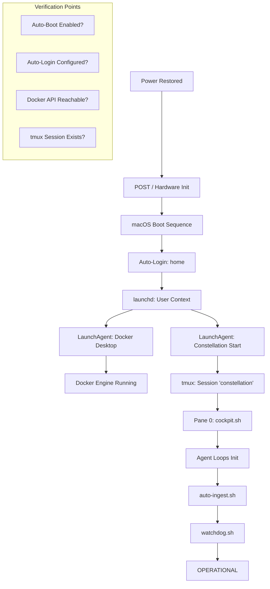

# Recovery Architecture Map — Unplug Resilience

**Version:** 1.0.0
**Owner:** Psyche (CTO)
**Exegete:** Cartographer (CIO)
**Status:** DRAFT — Following Failed Physical Unplug Test (2026-02-16)

## 1. Recovery Chain Diagram



## 2. Component Registry

| Component | Type | Responsibility | Config Location | Dependencies |
|-----------|------|----------------|-----------------|--------------|
| `com.apple.loginwindow` | System | Auto-login for `home` user | `kcpassword` / System Prefs | None |
| `Docker Desktop` | Login Item | Hypervisor + Engine | `Docker Settings` | None |
| `com.syncrescendence.start` | LaunchAgent | Spawns tmux + Cockpit | `~/Library/LaunchAgents/` | Docker |
| `cockpit.sh` | Script | Main orchestration hub | `/bin/cockpit.sh` | tmux |
| `watchdog.sh` | Script | Health monitoring / restarts | `/bin/watchdog.sh` | launchd |

## 3. Failure Mode Table

| Component | Failure Mode | Detection | Recovery Action | RTO (Est) |
|-----------|--------------|-----------|-----------------|-----------|
| Hardware | Auto-boot fails | Manual observation | Enable 'Start automatically after power failure' | N/A |
| macOS | Stuck at Login | Ping fails | Ensure FileVault is configured for auto-login | 5m |
| Docker | Fails to start | `docker ps` fails | LaunchAgent retry loop | 3m |
| tmux | Session clash | `tmux ls` output | `tmux kill-session` in start script | 1m |
| Agents | Stale status | `watchdog.sh` alert | `kill -9` and restart pane | 2m |

## 4. Verification Checklist

1. [ ] **Hardware:** `sudo pmset -g | grep autorestart` returns `autorestart 1`.
2. [ ] **Login:** Verify `/etc/kcpassword` exists and auto-login is active.
3. [ ] **LaunchAgents:** `launchctl list | grep syncrescendence` shows status `0`.
4. [ ] **Docker:** `docker info` returns valid engine state.
5. [ ] **tmux:** `tmux has-session -t constellation` returns exit code `0`.
6. [ ] **Cockpit:** `tail -f orchestration/logs/cockpit.log` shows active loops.

## 5. Edge Case Catalog

*   **FileVault Interruption:** If FileVault is enabled, auto-login may be blocked unless a specific token is present. *Mitigation:* Use `sysadminctl` to set auto-login correctly.
*   **Docker Update Loop:** Docker Desktop might prompt for updates on start, blocking the engine. *Mitigation:* Disable "Check for updates" in Docker settings.
*   **Stale Lockfiles:** `/tmp` is cleared, but application-specific locks in `~/Library/Application Support/` might persist. *Mitigation:* Cockpit must clean its own locks on start.

## 6. Test Procedure (Full Unplug)

1. Ensure all agents are in `STANDBY` or `IDLE`.
2. Physically disconnect power from Mac mini for 60 seconds.
3. Reconnect power.
4. **Measure T+0:** Power on.
5. **Measure T+Login:** macOS desktop visible / SSH available.
6. **Measure T+Operational:** Watchdog reports all agents `ACTIVE`.
7. **Pass Criteria:** System returns to `OPERATIONAL` status within 10 minutes without manual intervention.

## 7. Neural Bridge (Mac mini ↔ MBA)

The Neural Bridge is the constellation's circulatory system. If this link is severed, the Mac mini is isolated from the Strategic node (MBA/Ajna).

### A. Topology
- **MBA (Ajna)** ↔ `ssh mini` ↔ **Mac mini (Commander)**
- **Mac mini (Psyche)** ↔ `ssh macbook-air` ↔ **MBA (Ajna)**

### B. Recovery Action
| Symptom | Recovery Action |
|---------|-----------------|
| SSH Timeout | Check mDNS (`.local` resolution); restart `sshd` on target machine. |
| Auth Failure | Verify `~/.ssh/id_ed25519*` exists and `authorized_keys` permissions are `600`. |
| Dispatch Error | Verify `SYNCRESCENDENCE_REMOTE_AGENT_HOST_*` env vars in `~/.zshrc`. |

### C. Vital Health Check
```bash
# From Mac mini:
ssh -o BatchMode=yes -o ConnectTimeout=5 macbook-air hostname
```
Failure here triggers an immediate **VITAL ORGAN FAILURE** alert in the health watchdog.
